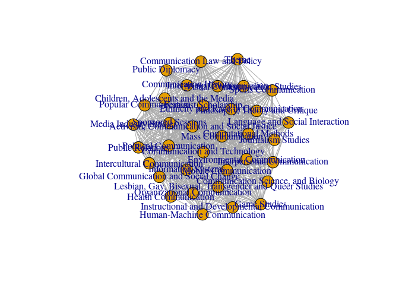

An analysis of the ICA 2020 program
================
Chung-hong Chan [1]

-   [What the "big 5" divisions are writing?](#what-the-big-5-divisions-are-writing)
-   [Similarity between groups](#similarity-between-groups)
-   [Newsmap: US-Centrism](#newsmap-us-centrism)
-   [Which groups need more chairs?](#which-groups-need-more-chairs)
-   [Why some presentations are early in the morning?](#why-some-presentations-are-early-in-the-morning)

``` r
require(tidyverse)
```

    ## Loading required package: tidyverse

    ## ── Attaching packages ─────────────────────────────────────── tidyverse 1.3.0 ──

    ## ✔ ggplot2 3.2.1     ✔ purrr   0.3.3
    ## ✔ tibble  2.1.3     ✔ dplyr   0.8.4
    ## ✔ tidyr   1.0.0     ✔ stringr 1.4.0
    ## ✔ readr   1.3.1     ✔ forcats 0.4.0

    ## ── Conflicts ────────────────────────────────────────── tidyverse_conflicts() ──
    ## ✖ dplyr::filter() masks stats::filter()
    ## ✖ dplyr::lag()    masks stats::lag()

``` r
require(textclean)
```

    ## Loading required package: textclean

``` r
require(quanteda)
```

    ## Loading required package: quanteda

    ## Package version: 2.0.0

    ## Parallel computing: 2 of 4 threads used.

    ## See https://quanteda.io for tutorials and examples.

    ## 
    ## Attaching package: 'quanteda'

    ## The following object is masked from 'package:utils':
    ## 
    ##     View

``` r
ica_raw <- rio::import('70th Annual ICA Conference_29FEB2020.csv') %>% as_tibble
ica_raw
```

    ## # A tibble: 2,882 x 19
    ##    `Session or Eve… `Session or Eve… `Session or Eve… `Session or Eve…
    ##    <chr>            <chr>            <chr>            <chr>           
    ##  1 ICA Executive C… Business Meeting Sponsored Sessi… 19-May-2020     
    ##  2 Board of Direct… Breakfast        Sponsored Sessi… 20-May-2020     
    ##  3 Annual ICA Boar… Business Meeting Sponsored Sessi… 20-May-2020     
    ##  4 Board meeting l… Reception        Sponsored Sessi… 20-May-2020     
    ##  5 Volunteer Orien… Meeting          Sponsored Sessi… 20-May-2020     
    ##  6 Annual ICA Boar… Business Meeting Sponsored Sessi… 21-May-2020     
    ##  7 ICA Inclusion, … Meeting          Sponsored Sessi… 21-May-2020     
    ##  8 WELCOME TO COUN… Panel Session    Sponsored Sessi… 21-May-2020     
    ##  9 OPENING RECEPTI… Reception        Sponsored Sessi… 21-May-2020     
    ## 10 OPENING RECEPTI… Reception        Sponsored Sessi… 21-May-2020     
    ## # … with 2,872 more rows, and 15 more variables: `Session or Event Start
    ## #   Time` <chr>, `Session or Event End Time` <chr>, `Session or Event
    ## #   Location` <chr>, `Session or Event Details` <chr>, `Session or Event
    ## #   Participants/Hosts` <chr>, `Submission or Placeholder Title` <chr>,
    ## #   `Submission or Placeholder Start Time` <chr>, `Submission or Placeholder
    ## #   End Time` <chr>, `Submission Presenter Name` <chr>, `Submission
    ## #   Authors` <chr>, `Submission Status` <chr>, `Institutions All` <chr>,
    ## #   `Submission Body` <chr>, `Session Submission Sort Order` <int>, `The
    ## #   Program Report was last updated February 29, 2020 at 12:13 AM EST. To view
    ## #   the most recent meeting schedule online, visit
    ## #   https://ica2020.abstractcentral.com/planner.jsp` <lgl>

``` r
colnames(ica_raw)
```

    ##  [1] "Session or Event Title"                                                                                                                                                       
    ##  [2] "Session or Event Type"                                                                                                                                                        
    ##  [3] "Session or Event Division/Interest Group"                                                                                                                                     
    ##  [4] "Session or Event Date"                                                                                                                                                        
    ##  [5] "Session or Event Start Time"                                                                                                                                                  
    ##  [6] "Session or Event End Time"                                                                                                                                                    
    ##  [7] "Session or Event Location"                                                                                                                                                    
    ##  [8] "Session or Event Details"                                                                                                                                                     
    ##  [9] "Session or Event Participants/Hosts"                                                                                                                                          
    ## [10] "Submission or Placeholder Title"                                                                                                                                              
    ## [11] "Submission or Placeholder Start Time"                                                                                                                                         
    ## [12] "Submission or Placeholder End Time"                                                                                                                                           
    ## [13] "Submission Presenter Name"                                                                                                                                                    
    ## [14] "Submission Authors"                                                                                                                                                           
    ## [15] "Submission Status"                                                                                                                                                            
    ## [16] "Institutions All"                                                                                                                                                             
    ## [17] "Submission Body"                                                                                                                                                              
    ## [18] "Session Submission Sort Order"                                                                                                                                                
    ## [19] "The Program Report was last updated February 29, 2020 at 12:13 AM EST. To view the most recent meeting schedule online, visit https://ica2020.abstractcentral.com/planner.jsp"

I am only interested in a few columns.

``` r
colnames(ica_raw)[2] <- "event_type"
colnames(ica_raw)[3] <- "event_group"
colnames(ica_raw)[5] <- "start_time"
colnames(ica_raw)[8] <- "event_info"
colnames(ica_raw)[17] <- "abstract"
ica_raw %>% count(event_type) -> all_event_types
### I am only interested in these sessions.
all_event_types[c(5, 6, 7, 8, 9, 11, 14),]
```

    ## # A tibble: 7 x 2
    ##   event_type                      n
    ##   <chr>                       <int>
    ## 1 Extended Session               20
    ## 2 High-Density Paper Session    194
    ## 3 Hybrid High-Density Session   197
    ## 4 Innovative Format              17
    ## 5 Interactive Paper Session     250
    ## 6 Panel Session                 914
    ## 7 Standard Paper Session       1121

``` r
##probably not the cleanest.

ica_raw %>% filter(event_type %in% all_event_types$event_type[c(5, 6, 7, 8, 9, 11, 14)]) %>% mutate(abstract = str_remove(replace_html(abstract), "^Abstracts? ?B?o?d?y?:? ?")) %>% filter(abstract != "") -> ica
ica %>% count(event_group, sort = TRUE) %>% add_count(wt = n, name = "total") %>% mutate(percent = round((n / total) * 100,2)) %>% select(-total) %>% knitr::kable()
```

| event\_group                                          |    n|  percent|
|:------------------------------------------------------|----:|--------:|
| Health Communication                                  |  267|     9.93|
| Communication and Technology                          |  232|     8.63|
| Journalism Studies                                    |  199|     7.40|
| Political Communication                               |  192|     7.14|
| Mass Communication                                    |  153|     5.69|
| Information Systems                                   |  141|     5.25|
| Public Relations                                      |   88|     3.27|
| Interpersonal Communication                           |   78|     2.90|
| Computational Methods                                 |   71|     2.64|
| Media Industry Studies                                |   71|     2.64|
| Environmental Communication                           |   69|     2.57|
| Organizational Communication                          |   69|     2.57|
| Sponsored Sessions                                    |   68|     2.53|
| Activism, Communication and Social Justice            |   62|     2.31|
| Mobile Communication                                  |   59|     2.19|
| Children, Adolescents and the Media                   |   58|     2.16|
| Global Communication and Social Change                |   58|     2.16|
| Instructional and Developmental Communication         |   58|     2.16|
| Popular Communication                                 |   58|     2.16|
| Ethnicity and Race in Communication                   |   57|     2.12|
| Game Studies                                          |   57|     2.12|
| Feminist Scholarship                                  |   55|     2.05|
| Human-Machine Communication                           |   54|     2.01|
| Visual Communication Studies                          |   52|     1.93|
| Sports Communication                                  |   45|     1.67|
| Philosophy, Theory and Critique                       |   44|     1.64|
| Lesbian, Gay, Bisexual, Transgender and Queer Studies |   36|     1.34|
| Intercultural Communication                           |   35|     1.30|
| Communication History                                 |   34|     1.26|
| Language and Social Interaction                       |   33|     1.23|
| Communication Science, and Biology                    |   30|     1.12|
| Communication Law and Policy                          |   28|     1.04|
| Theme                                                 |   28|     1.04|
| Intergroup Communication                              |   25|     0.93|
| Public Diplomacy                                      |   24|     0.89|

``` r
abstract_corpus <- corpus(ica$abstract)
docvars(abstract_corpus, "group") <- ica$event_group
```

``` r
dfm(abstract_corpus, tolower = TRUE, stem = TRUE, remove_punct = TRUE, remove_symbols = TRUE, remove = stopwords('en')) %>% dfm_select("^[A-Za-z]+$", valuetype = 'regex') -> abstract_dfm
```

Top Features of all ICA abstracts.

``` r
topfeatures(abstract_dfm, n = 50)
```

    ##        media        studi       social          use     communic     research 
    ##         4052         3732         3375         2938         2224         2198 
    ##         news       inform       effect        polit       public       examin 
    ##         2093         1665         1571         1461         1459         1307 
    ##       result        onlin       differ     particip         find         data 
    ##         1288         1234         1227         1200         1197         1196 
    ##         also          can        paper      analysi        relat        peopl 
    ##         1143         1096         1071         1059         1033         1028 
    ##      content       health       messag       cultur        digit     influenc 
    ##          995          980          978          954          954          938 
    ##       experi      practic      discuss     behavior      perceiv          one 
    ##          935          908          903          873          873          872 
    ## relationship          new        posit         user       theori         show 
    ##          854          853          843          839          834          825 
    ##        engag   understand     individu       provid      increas     interact 
    ##          821          815          799          784          784          783 
    ##        model          two 
    ##          783          780

What the "big 5" divisions are writing?
=======================================

Health Communication
--------------------

``` r
textstat_keyness(abstract_dfm, target = docvars(abstract_dfm, "group") == "Health Communication") %>% textplot_keyness
```


CAT
---

``` r
textstat_keyness(abstract_dfm, target = docvars(abstract_dfm, "group") == "Communication and Technology") %>% textplot_keyness
```


JSD
---

``` r
textstat_keyness(abstract_dfm, target = docvars(abstract_dfm, "group") == "Journalism Studies") %>% textplot_keyness
```


POLCOM
------

``` r
textstat_keyness(abstract_dfm, target = docvars(abstract_dfm, "group") == "Political Communication") %>% textplot_keyness
```


MASSCOM
-------

``` r
textstat_keyness(abstract_dfm, target = docvars(abstract_dfm, "group") == "Mass Communication") %>% textplot_keyness
```


and of course,

Computational methods
---------------------

``` r
textstat_keyness(abstract_dfm, target = docvars(abstract_dfm, "group") == "Computational Methods") %>% textplot_keyness
```


and

theme
-----

``` r
textstat_keyness(abstract_dfm, target = docvars(abstract_dfm, "group") == "Theme") %>% textplot_keyness
```


Similarity between groups
=========================

``` r
uni_groups <- unique(docvars(abstract_dfm, "group"))
group_dfm <- map(uni_groups, ~ apply(dfm_subset(abstract_dfm, group == .), 2, sum))
names(group_dfm) <- uni_groups

## How similar is PolCom 3 and JSD 12

require(lsa)
```

    ## Loading required package: lsa

    ## Loading required package: SnowballC

``` r
## So ugly
cosine(group_dfm['Political Communication'][[1]], group_dfm['Journalism Studies'][[1]])
```

    ##          [,1]
    ## [1,] 0.770592

``` r
## Polcom 3 and Comm Law 4
cosine(group_dfm['Political Communication'][[1]], group_dfm['Communication Law and Policy'][[1]])
```

    ##           [,1]
    ## [1,] 0.5040687

``` r
t(combn(uni_groups, 2)) %>% as_tibble(.name_repair = "minimal") -> pairs
colnames(pairs) <- c('gp1', 'gp2')

get_cosine <- function(gp1, gp2, group_dfm) {
    cosine(group_dfm[gp1][[1]], group_dfm[gp2][[1]])[1,1]
}

get_cosine("Political Communication", "Theme", group_dfm)
```

    ## [1] 0.4353212

``` r
pairs %>% mutate(weight = map2_dbl(gp1, gp2, get_cosine, group_dfm = group_dfm)) -> pairs
require(igraph)
```

    ## Loading required package: igraph

    ## 
    ## Attaching package: 'igraph'

    ## The following object is masked from 'package:quanteda':
    ## 
    ##     as.igraph

    ## The following objects are masked from 'package:dplyr':
    ## 
    ##     as_data_frame, groups, union

    ## The following objects are masked from 'package:purrr':
    ## 
    ##     compose, simplify

    ## The following object is masked from 'package:tidyr':
    ## 
    ##     crossing

    ## The following object is masked from 'package:tibble':
    ## 
    ##     as_data_frame

    ## The following objects are masked from 'package:stats':
    ## 
    ##     decompose, spectrum

    ## The following object is masked from 'package:base':
    ## 
    ##     union

``` r
ica_graph <- graph_from_data_frame(pairs, directed = FALSE)
### Not informative at all
plot(ica_graph)
```



Most similar

``` r
pairs %>% arrange(desc(weight)) %>% head(n = 50) %>% knitr::kable()
```

| gp1                                        | gp2                                                   |     weight|
|:-------------------------------------------|:------------------------------------------------------|----------:|
| Mass Communication                         | Communication and Technology                          |  0.8600901|
| Information Systems                        | Communication and Technology                          |  0.8597381|
| Political Communication                    | Mass Communication                                    |  0.8419335|
| Mass Communication                         | Information Systems                                   |  0.8408760|
| Health Communication                       | Information Systems                                   |  0.8327283|
| Communication and Technology               | Computational Methods                                 |  0.8247976|
| Political Communication                    | Communication and Technology                          |  0.8053256|
| Communication and Technology               | Mobile Communication                                  |  0.7996365|
| Health Communication                       | Mass Communication                                    |  0.7858658|
| Health Communication                       | Communication and Technology                          |  0.7759992|
| Political Communication                    | Journalism Studies                                    |  0.7705920|
| Health Communication                       | Interpersonal Communication                           |  0.7680352|
| Public Relations                           | Organizational Communication                          |  0.7605388|
| Information Systems                        | Communication Science, and Biology                    |  0.7566175|
| Mass Communication                         | Computational Methods                                 |  0.7555553|
| Communication and Technology               | Children, Adolescents and the Media                   |  0.7507227|
| Political Communication                    | Computational Methods                                 |  0.7491128|
| Interpersonal Communication                | Communication and Technology                          |  0.7403624|
| Philosophy, Theory and Critique            | Activism, Communication and Social Justice            |  0.7394289|
| Activism, Communication and Social Justice | Ethnicity and Race in Communication                   |  0.7391575|
| Communication and Technology               | Sponsored Sessions                                    |  0.7369356|
| Popular Communication                      | Intercultural Communication                           |  0.7366973|
| Information Systems                        | Computational Methods                                 |  0.7343714|
| Global Communication and Social Change     | Sponsored Sessions                                    |  0.7342234|
| Mass Communication                         | Environmental Communication                           |  0.7341166|
| Public Relations                           | Sponsored Sessions                                    |  0.7316993|
| Communication and Technology               | Communication Science, and Biology                    |  0.7239485|
| Activism, Communication and Social Justice | Communication and Technology                          |  0.7236737|
| Philosophy, Theory and Critique            | Global Communication and Social Change                |  0.7223500|
| Popular Communication                      | Media Industry Studies                                |  0.7218148|
| Activism, Communication and Social Justice | Global Communication and Social Change                |  0.7211085|
| Interpersonal Communication                | Mass Communication                                    |  0.7197884|
| Mass Communication                         | Children, Adolescents and the Media                   |  0.7159478|
| Philosophy, Theory and Critique            | Communication and Technology                          |  0.7144059|
| Mass Communication                         | Journalism Studies                                    |  0.7132753|
| Sponsored Sessions                         | Intercultural Communication                           |  0.7126904|
| Environmental Communication                | Communication and Technology                          |  0.7121789|
| Organizational Communication               | Sponsored Sessions                                    |  0.7102609|
| Political Communication                    | Activism, Communication and Social Justice            |  0.7101507|
| Political Communication                    | Information Systems                                   |  0.7084504|
| Communication and Technology               | Public Relations                                      |  0.7077545|
| Environmental Communication                | Sponsored Sessions                                    |  0.7076118|
| Communication and Technology               | Lesbian, Gay, Bisexual, Transgender and Queer Studies |  0.7049189|
| Activism, Communication and Social Justice | Lesbian, Gay, Bisexual, Transgender and Queer Studies |  0.7040059|
| Computational Methods                      | Sponsored Sessions                                    |  0.7028721|
| Philosophy, Theory and Critique            | Political Communication                               |  0.7019654|
| Mass Communication                         | Communication Science, and Biology                    |  0.6983418|
| Communication and Technology               | Intercultural Communication                           |  0.6980845|
| Interpersonal Communication                | Information Systems                                   |  0.6979278|
| Ethnicity and Race in Communication        | Sponsored Sessions                                    |  0.6964196|

Newsmap: US-Centrism
====================

Classify all abstracts by the geographical prediction algorithm by Watanabe (2017) [2].

``` r
require(newsmap)
```

    ## Loading required package: newsmap

``` r
toks <- tokens(abstract_corpus, remove_punct = TRUE, remove_numbers = TRUE, remove_symbols = TRUE) %>% tokens_tolower %>% tokens_remove(stopwords('english'), valuetype = 'fixed', padding = TRUE)
country_label <- tokens_lookup(toks, data_dictionary_newsmap_en, levels = 3)
dfmt_label <- dfm(country_label)

dfmt_feat <- dfm(toks) %>% dfm_select(pattern = "^[a-z]", selection = "keep", valuetype = "regex")

model <- textmodel_newsmap(dfmt_feat, dfmt_label)
coef(model, n = 7)[c("us", "gb", "de", "br", "jp", "hk", "cn")]
```

    ## $us
    ##          us    american        york   americans trafficking  washington 
    ##    6.374726    6.022749    4.969946    4.571916    4.061091    3.900748 
    ##       e-cig 
    ##    3.856296 
    ## 
    ## $gb
    ##          uk      london   migrators       e-cig franchisees     tapinto 
    ##    5.881744    5.639182    5.233717    4.798399    4.479945    4.415406 
    ##    laughing 
    ##    4.415406 
    ## 
    ## $de
    ##     germany      german         und        nfcc instamancer       meier 
    ##    6.217457    5.917353    5.629671    5.224205    4.793422    4.713380 
    ##       gesis 
    ##    4.626368 
    ## 
    ## $br
    ##      brazil venezuelans        ncis     orleans   brazilian     roraima 
    ##    5.829737    4.625764    4.507981    4.507981    4.374449    4.374449 
    ##      fixers 
    ##    4.374449 
    ## 
    ## $jp
    ##         japan      japanese          midi         tokyo       koreans 
    ##      5.696188      5.310525      5.310525      4.269071      4.269071 
    ##       anime's skateboarding 
    ##      4.086750      4.086750 
    ## 
    ## $hk
    ##            kong              hk             yue     hongkongers     blue-ribbon 
    ##        5.892231        4.864445        4.496720        4.378937        4.378937 
    ## countermovement          youths 
    ##        4.245406        4.245406 
    ## 
    ## $cn
    ##       chinese         china     migrators           tcm           npd 
    ##      7.554475      7.208458      5.089371      4.930307      4.698505 
    ##          midi study-with-me 
    ##      4.396224      4.335600

How US-centric is ICA?

``` r
country <- predict(model)
tibble(country) %>% count(country, sort = TRUE) %>% add_count(wt = n, name = 'totaln') %>% mutate(percent = round((n / totaln) * 100, 2)) %>% select(country, percent) %>% knitr::kable()
```

| country |  percent|
|:--------|--------:|
| us      |    61.79|
| cn      |    24.96|
| au      |     2.83|
| gb      |     2.16|
| de      |     1.34|
| in      |     1.34|
| hk      |     1.00|
| nz      |     0.52|
| tr      |     0.48|
| kr      |     0.37|
| sg      |     0.37|
| fr      |     0.22|
| ke      |     0.22|
| br      |     0.15|
| il      |     0.15|
| no      |     0.15|
| ph      |     0.15|
| pl      |     0.15|
| tw      |     0.15|
| dk      |     0.11|
| eg      |     0.11|
| ng      |     0.11|
| nl      |     0.11|
| ru      |     0.11|
| sy      |     0.11|
| be      |     0.07|
| ca      |     0.07|
| es      |     0.07|
| mx      |     0.07|
| ua      |     0.07|
| ae      |     0.04|
| at      |     0.04|
| ch      |     0.04|
| fi      |     0.04|
| gh      |     0.04|
| id      |     0.04|
| ir      |     0.04|
| it      |     0.04|
| jp      |     0.04|
| rs      |     0.04|
| sa      |     0.04|
| za      |     0.04|

Rank division/IG by percetnage of non-US abstracts

``` r
tibble(group = ica$event_group, country) %>% mutate(nonus = country != "us") %>% group_by(group) %>% summarise(totalnonus = sum(nonus), n = n()) %>% mutate(percent = round((totalnonus / n) * 100)) %>% arrange(desc(percent)) %>% knitr::kable()
```

| group                                                 |  totalnonus|    n|  percent|
|:------------------------------------------------------|-----------:|----:|--------:|
| Lesbian, Gay, Bisexual, Transgender and Queer Studies |          24|   36|       67|
| Media Industry Studies                                |          47|   71|       66|
| Interpersonal Communication                           |          48|   78|       62|
| Public Diplomacy                                      |          15|   24|       62|
| Human-Machine Communication                           |          33|   54|       61|
| Intercultural Communication                           |          21|   35|       60|
| Global Communication and Social Change                |          34|   58|       59|
| Popular Communication                                 |          33|   58|       57|
| Activism, Communication and Social Justice            |          32|   62|       52|
| Intergroup Communication                              |          12|   25|       48|
| Health Communication                                  |         118|  267|       44|
| Mobile Communication                                  |          26|   59|       44|
| Sponsored Sessions                                    |          30|   68|       44|
| Sports Communication                                  |          20|   45|       44|
| Game Studies                                          |          24|   57|       42|
| Communication and Technology                          |          94|  232|       41|
| Children, Adolescents and the Media                   |          23|   58|       40|
| Ethnicity and Race in Communication                   |          23|   57|       40|
| Communication Law and Policy                          |          11|   28|       39|
| Feminist Scholarship                                  |          21|   55|       38|
| Mass Communication                                    |          56|  153|       37|
| Environmental Communication                           |          25|   69|       36|
| Language and Social Interaction                       |          12|   33|       36|
| Visual Communication Studies                          |          18|   52|       35|
| Public Relations                                      |          28|   88|       32|
| Information Systems                                   |          43|  141|       30|
| Philosophy, Theory and Critique                       |          13|   44|       30|
| Organizational Communication                          |          19|   69|       28|
| Political Communication                               |          53|  192|       28|
| Communication History                                 |           8|   34|       24|
| Computational Methods                                 |          13|   71|       18|
| Journalism Studies                                    |          36|  199|       18|
| Instructional and Developmental Communication         |           9|   58|       16|
| Communication Science, and Biology                    |           3|   30|       10|
| Theme                                                 |           2|   28|        7|

Which groups need more chairs?
==============================

``` r
str_extract(ica$event_info, "Expected Attendance:[0-9]+")
```

    ##    [1] "Expected Attendance:50"  "Expected Attendance:50" 
    ##    [3] "Expected Attendance:50"  "Expected Attendance:50" 
    ##    [5] "Expected Attendance:50"  "Expected Attendance:50" 
    ##    [7] "Expected Attendance:50"  "Expected Attendance:50" 
    ##    [9] "Expected Attendance:50"  "Expected Attendance:75" 
    ##   [11] "Expected Attendance:75"  "Expected Attendance:75" 
    ##   [13] "Expected Attendance:75"  "Expected Attendance:75" 
    ##   [15] "Expected Attendance:75"  "Expected Attendance:75" 
    ##   [17] "Expected Attendance:75"  "Expected Attendance:75" 
    ##   [19] "Expected Attendance:75"  "Expected Attendance:75" 
    ##   [21] "Expected Attendance:75"  "Expected Attendance:75" 
    ##   [23] "Expected Attendance:75"  "Expected Attendance:50" 
    ##   [25] "Expected Attendance:50"  "Expected Attendance:50" 
    ##   [27] "Expected Attendance:50"  "Expected Attendance:50" 
    ##   [29] "Expected Attendance:50"  "Expected Attendance:50" 
    ##   [31] "Expected Attendance:50"  "Expected Attendance:50" 
    ##   [33] "Expected Attendance:75"  "Expected Attendance:75" 
    ##   [35] "Expected Attendance:75"  "Expected Attendance:75" 
    ##   [37] "Expected Attendance:75"  "Expected Attendance:50" 
    ##   [39] "Expected Attendance:50"  "Expected Attendance:50" 
    ##   [41] "Expected Attendance:50"  "Expected Attendance:50" 
    ##   [43] NA                        NA                       
    ##   [45] NA                        NA                       
    ##   [47] "Expected Attendance:50"  "Expected Attendance:50" 
    ##   [49] "Expected Attendance:50"  "Expected Attendance:50" 
    ##   [51] "Expected Attendance:50"  "Expected Attendance:50" 
    ##   [53] "Expected Attendance:50"  "Expected Attendance:50" 
    ##   [55] "Expected Attendance:50"  "Expected Attendance:50" 
    ##   [57] "Expected Attendance:50"  "Expected Attendance:50" 
    ##   [59] "Expected Attendance:50"  "Expected Attendance:50" 
    ##   [61] "Expected Attendance:50"  "Expected Attendance:50" 
    ##   [63] "Expected Attendance:50"  "Expected Attendance:50" 
    ##   [65] "Expected Attendance:50"  "Expected Attendance:50" 
    ##   [67] "Expected Attendance:50"  "Expected Attendance:50" 
    ##   [69] "Expected Attendance:50"  "Expected Attendance:75" 
    ##   [71] "Expected Attendance:75"  "Expected Attendance:75" 
    ##   [73] "Expected Attendance:75"  NA                       
    ##   [75] NA                        NA                       
    ##   [77] NA                        NA                       
    ##   [79] NA                        NA                       
    ##   [81] NA                        "Expected Attendance:75" 
    ##   [83] "Expected Attendance:75"  "Expected Attendance:75" 
    ##   [85] "Expected Attendance:75"  NA                       
    ##   [87] NA                        NA                       
    ##   [89] NA                        "Expected Attendance:75" 
    ##   [91] "Expected Attendance:75"  "Expected Attendance:75" 
    ##   [93] "Expected Attendance:75"  "Expected Attendance:75" 
    ##   [95] "Expected Attendance:50"  "Expected Attendance:50" 
    ##   [97] "Expected Attendance:50"  "Expected Attendance:50" 
    ##   [99] "Expected Attendance:50"  "Expected Attendance:50" 
    ##  [101] NA                        NA                       
    ##  [103] NA                        NA                       
    ##  [105] NA                        "Expected Attendance:75" 
    ##  [107] "Expected Attendance:75"  "Expected Attendance:75" 
    ##  [109] "Expected Attendance:75"  "Expected Attendance:50" 
    ##  [111] "Expected Attendance:50"  "Expected Attendance:50" 
    ##  [113] "Expected Attendance:50"  "Expected Attendance:50" 
    ##  [115] NA                        NA                       
    ##  [117] NA                        NA                       
    ##  [119] "Expected Attendance:100" "Expected Attendance:100"
    ##  [121] "Expected Attendance:100" "Expected Attendance:100"
    ##  [123] "Expected Attendance:100" "Expected Attendance:100"
    ##  [125] "Expected Attendance:100" "Expected Attendance:100"
    ##  [127] "Expected Attendance:100" "Expected Attendance:50" 
    ##  [129] "Expected Attendance:50"  "Expected Attendance:50" 
    ##  [131] "Expected Attendance:50"  "Expected Attendance:50" 
    ##  [133] "Expected Attendance:100" "Expected Attendance:100"
    ##  [135] "Expected Attendance:100" "Expected Attendance:100"
    ##  [137] "Expected Attendance:100" "Expected Attendance:100"
    ##  [139] "Expected Attendance:100" NA                       
    ##  [141] NA                        NA                       
    ##  [143] NA                        "Expected Attendance:50" 
    ##  [145] "Expected Attendance:50"  "Expected Attendance:50" 
    ##  [147] "Expected Attendance:50"  "Expected Attendance:50" 
    ##  [149] "Expected Attendance:50"  "Expected Attendance:50" 
    ##  [151] "Expected Attendance:50"  "Expected Attendance:50" 
    ##  [153] "Expected Attendance:50"  "Expected Attendance:50" 
    ##  [155] "Expected Attendance:50"  "Expected Attendance:50" 
    ##  [157] "Expected Attendance:50"  "Expected Attendance:50" 
    ##  [159] "Expected Attendance:50"  "Expected Attendance:50" 
    ##  [161] "Expected Attendance:50"  "Expected Attendance:50" 
    ##  [163] "Expected Attendance:50"  "Expected Attendance:50" 
    ##  [165] "Expected Attendance:50"  "Expected Attendance:50" 
    ##  [167] NA                        NA                       
    ##  [169] NA                        NA                       
    ##  [171] NA                        "Expected Attendance:50" 
    ##  [173] "Expected Attendance:50"  "Expected Attendance:50" 
    ##  [175] "Expected Attendance:50"  "Expected Attendance:50" 
    ##  [177] "Expected Attendance:50"  "Expected Attendance:50" 
    ##  [179] "Expected Attendance:50"  "Expected Attendance:50" 
    ##  [181] "Expected Attendance:100" "Expected Attendance:100"
    ##  [183] "Expected Attendance:100" "Expected Attendance:100"
    ##  [185] NA                        NA                       
    ##  [187] NA                        NA                       
    ##  [189] "Expected Attendance:50"  "Expected Attendance:50" 
    ##  [191] "Expected Attendance:50"  "Expected Attendance:50" 
    ##  [193] "Expected Attendance:100" "Expected Attendance:100"
    ##  [195] "Expected Attendance:100" "Expected Attendance:100"
    ##  [197] "Expected Attendance:75"  "Expected Attendance:75" 
    ##  [199] "Expected Attendance:75"  "Expected Attendance:75" 
    ##  [201] "Expected Attendance:75"  "Expected Attendance:50" 
    ##  [203] "Expected Attendance:50"  "Expected Attendance:50" 
    ##  [205] "Expected Attendance:50"  "Expected Attendance:50" 
    ##  [207] "Expected Attendance:50"  "Expected Attendance:50" 
    ##  [209] "Expected Attendance:50"  "Expected Attendance:50" 
    ##  [211] "Expected Attendance:75"  "Expected Attendance:75" 
    ##  [213] "Expected Attendance:75"  "Expected Attendance:75" 
    ##  [215] NA                        NA                       
    ##  [217] NA                        NA                       
    ##  [219] NA                        NA                       
    ##  [221] NA                        NA                       
    ##  [223] NA                        NA                       
    ##  [225] NA                        NA                       
    ##  [227] "Expected Attendance:150" "Expected Attendance:150"
    ##  [229] "Expected Attendance:150" "Expected Attendance:150"
    ##  [231] "Expected Attendance:75"  "Expected Attendance:75" 
    ##  [233] "Expected Attendance:75"  "Expected Attendance:75" 
    ##  [235] NA                        NA                       
    ##  [237] NA                        NA                       
    ##  [239] "Expected Attendance:100" "Expected Attendance:100"
    ##  [241] "Expected Attendance:100" "Expected Attendance:100"
    ##  [243] "Expected Attendance:100" "Expected Attendance:75" 
    ##  [245] "Expected Attendance:75"  "Expected Attendance:75" 
    ##  [247] "Expected Attendance:75"  "Expected Attendance:100"
    ##  [249] "Expected Attendance:100" "Expected Attendance:100"
    ##  [251] "Expected Attendance:100" "Expected Attendance:100"
    ##  [253] NA                        NA                       
    ##  [255] NA                        NA                       
    ##  [257] "Expected Attendance:100" "Expected Attendance:100"
    ##  [259] "Expected Attendance:100" "Expected Attendance:100"
    ##  [261] "Expected Attendance:100" "Expected Attendance:100"
    ##  [263] "Expected Attendance:100" "Expected Attendance:100"
    ##  [265] "Expected Attendance:100" "Expected Attendance:50" 
    ##  [267] "Expected Attendance:50"  "Expected Attendance:50" 
    ##  [269] "Expected Attendance:50"  "Expected Attendance:50" 
    ##  [271] "Expected Attendance:25"  "Expected Attendance:25" 
    ##  [273] "Expected Attendance:25"  "Expected Attendance:25" 
    ##  [275] "Expected Attendance:50"  "Expected Attendance:50" 
    ##  [277] "Expected Attendance:50"  "Expected Attendance:50" 
    ##  [279] NA                        NA                       
    ##  [281] NA                        NA                       
    ##  [283] "Expected Attendance:50"  "Expected Attendance:50" 
    ##  [285] "Expected Attendance:50"  "Expected Attendance:50" 
    ##  [287] "Expected Attendance:50"  "Expected Attendance:100"
    ##  [289] "Expected Attendance:100" "Expected Attendance:100"
    ##  [291] "Expected Attendance:100" "Expected Attendance:100"
    ##  [293] "Expected Attendance:75"  "Expected Attendance:75" 
    ##  [295] "Expected Attendance:75"  "Expected Attendance:75" 
    ##  [297] "Expected Attendance:75"  "Expected Attendance:75" 
    ##  [299] "Expected Attendance:75"  "Expected Attendance:75" 
    ##  [301] "Expected Attendance:50"  "Expected Attendance:50" 
    ##  [303] "Expected Attendance:50"  "Expected Attendance:50" 
    ##  [305] "Expected Attendance:50"  "Expected Attendance:50" 
    ##  [307] "Expected Attendance:50"  "Expected Attendance:50" 
    ##  [309] "Expected Attendance:75"  "Expected Attendance:75" 
    ##  [311] "Expected Attendance:75"  "Expected Attendance:75" 
    ##  [313] "Expected Attendance:75"  NA                       
    ##  [315] NA                        NA                       
    ##  [317] NA                        "Expected Attendance:50" 
    ##  [319] "Expected Attendance:50"  "Expected Attendance:50" 
    ##  [321] "Expected Attendance:50"  "Expected Attendance:50" 
    ##  [323] "Expected Attendance:50"  "Expected Attendance:50" 
    ##  [325] "Expected Attendance:50"  "Expected Attendance:50" 
    ##  [327] "Expected Attendance:75"  "Expected Attendance:75" 
    ##  [329] "Expected Attendance:75"  "Expected Attendance:75" 
    ##  [331] "Expected Attendance:75"  "Expected Attendance:50" 
    ##  [333] "Expected Attendance:50"  "Expected Attendance:50" 
    ##  [335] "Expected Attendance:50"  "Expected Attendance:50" 
    ##  [337] "Expected Attendance:50"  "Expected Attendance:50" 
    ##  [339] "Expected Attendance:50"  "Expected Attendance:50" 
    ##  [341] "Expected Attendance:50"  "Expected Attendance:50" 
    ##  [343] "Expected Attendance:50"  "Expected Attendance:50" 
    ##  [345] "Expected Attendance:50"  "Expected Attendance:50" 
    ##  [347] "Expected Attendance:50"  "Expected Attendance:50" 
    ##  [349] "Expected Attendance:50"  "Expected Attendance:50" 
    ##  [351] "Expected Attendance:50"  "Expected Attendance:50" 
    ##  [353] "Expected Attendance:50"  NA                       
    ##  [355] NA                        NA                       
    ##  [357] NA                        NA                       
    ##  [359] NA                        NA                       
    ##  [361] NA                        NA                       
    ##  [363] NA                        "Expected Attendance:150"
    ##  [365] "Expected Attendance:150" "Expected Attendance:150"
    ##  [367] "Expected Attendance:150" "Expected Attendance:150"
    ##  [369] "Expected Attendance:150" "Expected Attendance:150"
    ##  [371] "Expected Attendance:150" "Expected Attendance:150"
    ##  [373] "Expected Attendance:150" "Expected Attendance:150"
    ##  [375] "Expected Attendance:150" "Expected Attendance:150"
    ##  [377] "Expected Attendance:150" "Expected Attendance:150"
    ##  [379] "Expected Attendance:150" "Expected Attendance:150"
    ##  [381] "Expected Attendance:150" "Expected Attendance:150"
    ##  [383] "Expected Attendance:150" "Expected Attendance:150"
    ##  [385] "Expected Attendance:150" "Expected Attendance:150"
    ##  [387] "Expected Attendance:150" "Expected Attendance:150"
    ##  [389] NA                        NA                       
    ##  [391] NA                        NA                       
    ##  [393] NA                        NA                       
    ##  [395] NA                        NA                       
    ##  [397] NA                        NA                       
    ##  [399] NA                        NA                       
    ##  [401] NA                        NA                       
    ##  [403] NA                        NA                       
    ##  [405] NA                        NA                       
    ##  [407] NA                        NA                       
    ##  [409] NA                        NA                       
    ##  [411] NA                        NA                       
    ##  [413] NA                        NA                       
    ##  [415] NA                        NA                       
    ##  [417] NA                        NA                       
    ##  [419] NA                        NA                       
    ##  [421] NA                        NA                       
    ##  [423] NA                        NA                       
    ##  [425] NA                        NA                       
    ##  [427] NA                        NA                       
    ##  [429] NA                        NA                       
    ##  [431] NA                        NA                       
    ##  [433] NA                        NA                       
    ##  [435] "Expected Attendance:150" "Expected Attendance:150"
    ##  [437] "Expected Attendance:150" "Expected Attendance:150"
    ##  [439] "Expected Attendance:100" "Expected Attendance:100"
    ##  [441] "Expected Attendance:100" "Expected Attendance:100"
    ##  [443] "Expected Attendance:100" "Expected Attendance:50" 
    ##  [445] "Expected Attendance:50"  "Expected Attendance:50" 
    ##  [447] "Expected Attendance:50"  "Expected Attendance:50" 
    ##  [449] "Expected Attendance:50"  "Expected Attendance:50" 
    ##  [451] "Expected Attendance:50"  "Expected Attendance:50" 
    ##  [453] "Expected Attendance:75"  "Expected Attendance:75" 
    ##  [455] "Expected Attendance:75"  "Expected Attendance:75" 
    ##  [457] "Expected Attendance:75"  "Expected Attendance:75" 
    ##  [459] "Expected Attendance:75"  "Expected Attendance:75" 
    ##  [461] "Expected Attendance:75"  "Expected Attendance:25" 
    ##  [463] "Expected Attendance:25"  "Expected Attendance:25" 
    ##  [465] "Expected Attendance:25"  "Expected Attendance:50" 
    ##  [467] "Expected Attendance:50"  "Expected Attendance:50" 
    ##  [469] "Expected Attendance:50"  "Expected Attendance:50" 
    ##  [471] "Expected Attendance:100" "Expected Attendance:100"
    ##  [473] "Expected Attendance:100" "Expected Attendance:100"
    ##  [475] "Expected Attendance:100" "Expected Attendance:100"
    ##  [477] "Expected Attendance:100" "Expected Attendance:50" 
    ##  [479] "Expected Attendance:50"  "Expected Attendance:50" 
    ##  [481] "Expected Attendance:50"  NA                       
    ##  [483] NA                        NA                       
    ##  [485] NA                        "Expected Attendance:75" 
    ##  [487] "Expected Attendance:75"  "Expected Attendance:75" 
    ##  [489] "Expected Attendance:75"  "Expected Attendance:75" 
    ##  [491] "Expected Attendance:75"  "Expected Attendance:75" 
    ##  [493] "Expected Attendance:75"  "Expected Attendance:50" 
    ##  [495] "Expected Attendance:50"  "Expected Attendance:50" 
    ##  [497] "Expected Attendance:50"  "Expected Attendance:50" 
    ##  [499] "Expected Attendance:50"  "Expected Attendance:50" 
    ##  [501] "Expected Attendance:50"  NA                       
    ##  [503] NA                        NA                       
    ##  [505] NA                        NA                       
    ##  [507] NA                        NA                       
    ##  [509] "Expected Attendance:50"  "Expected Attendance:50" 
    ##  [511] "Expected Attendance:50"  "Expected Attendance:50" 
    ##  [513] "Expected Attendance:50"  "Expected Attendance:200"
    ##  [515] "Expected Attendance:200" "Expected Attendance:200"
    ##  [517] "Expected Attendance:200" "Expected Attendance:200"
    ##  [519] "Expected Attendance:50"  "Expected Attendance:50" 
    ##  [521] "Expected Attendance:50"  "Expected Attendance:50" 
    ##  [523] "Expected Attendance:50"  "Expected Attendance:50" 
    ##  [525] "Expected Attendance:50"  "Expected Attendance:50" 
    ##  [527] "Expected Attendance:50"  "Expected Attendance:50" 
    ##  [529] "Expected Attendance:50"  "Expected Attendance:50" 
    ##  [531] "Expected Attendance:50"  "Expected Attendance:50" 
    ##  [533] "Expected Attendance:50"  "Expected Attendance:50" 
    ##  [535] "Expected Attendance:50"  "Expected Attendance:50" 
    ##  [537] "Expected Attendance:50"  "Expected Attendance:50" 
    ##  [539] "Expected Attendance:50"  "Expected Attendance:50" 
    ##  [541] "Expected Attendance:50"  "Expected Attendance:50" 
    ##  [543] "Expected Attendance:50"  "Expected Attendance:50" 
    ##  [545] "Expected Attendance:50"  "Expected Attendance:50" 
    ##  [547] "Expected Attendance:50"  "Expected Attendance:50" 
    ##  [549] "Expected Attendance:50"  "Expected Attendance:50" 
    ##  [551] "Expected Attendance:50"  "Expected Attendance:75" 
    ##  [553] "Expected Attendance:75"  "Expected Attendance:75" 
    ##  [555] "Expected Attendance:75"  NA                       
    ##  [557] NA                        NA                       
    ##  [559] NA                        "Expected Attendance:50" 
    ##  [561] "Expected Attendance:50"  "Expected Attendance:50" 
    ##  [563] "Expected Attendance:50"  "Expected Attendance:50" 
    ##  [565] "Expected Attendance:100" "Expected Attendance:100"
    ##  [567] "Expected Attendance:100" "Expected Attendance:100"
    ##  [569] "Expected Attendance:100" "Expected Attendance:75" 
    ##  [571] "Expected Attendance:75"  "Expected Attendance:75" 
    ##  [573] "Expected Attendance:75"  "Expected Attendance:75" 
    ##  [575] "Expected Attendance:75"  "Expected Attendance:75" 
    ##  [577] "Expected Attendance:75"  "Expected Attendance:75" 
    ##  [579] "Expected Attendance:50"  "Expected Attendance:50" 
    ##  [581] "Expected Attendance:50"  "Expected Attendance:50" 
    ##  [583] "Expected Attendance:50"  "Expected Attendance:50" 
    ##  [585] "Expected Attendance:25"  "Expected Attendance:25" 
    ##  [587] "Expected Attendance:25"  "Expected Attendance:25" 
    ##  [589] "Expected Attendance:50"  "Expected Attendance:50" 
    ##  [591] "Expected Attendance:50"  "Expected Attendance:50" 
    ##  [593] "Expected Attendance:100" "Expected Attendance:100"
    ##  [595] "Expected Attendance:100" "Expected Attendance:100"
    ##  [597] "Expected Attendance:75"  "Expected Attendance:75" 
    ##  [599] "Expected Attendance:75"  "Expected Attendance:75" 
    ##  [601] "Expected Attendance:75"  "Expected Attendance:75" 
    ##  [603] "Expected Attendance:75"  NA                       
    ##  [605] NA                        NA                       
    ##  [607] NA                        "Expected Attendance:50" 
    ##  [609] "Expected Attendance:50"  "Expected Attendance:50" 
    ##  [611] "Expected Attendance:50"  "Expected Attendance:50" 
    ##  [613] NA                        NA                       
    ##  [615] NA                        "Expected Attendance:50" 
    ##  [617] "Expected Attendance:50"  "Expected Attendance:50" 
    ##  [619] "Expected Attendance:50"  "Expected Attendance:50" 
    ##  [621] "Expected Attendance:50"  "Expected Attendance:50" 
    ##  [623] "Expected Attendance:50"  "Expected Attendance:50" 
    ##  [625] "Expected Attendance:150" "Expected Attendance:150"
    ##  [627] "Expected Attendance:150" "Expected Attendance:150"
    ##  [629] "Expected Attendance:25"  "Expected Attendance:25" 
    ##  [631] "Expected Attendance:25"  "Expected Attendance:25" 
    ##  [633] "Expected Attendance:75"  "Expected Attendance:75" 
    ##  [635] "Expected Attendance:75"  "Expected Attendance:75" 
    ##  [637] "Expected Attendance:75"  NA                       
    ##  [639] NA                        NA                       
    ##  [641] NA                        "Expected Attendance:50" 
    ##  [643] "Expected Attendance:50"  "Expected Attendance:50" 
    ##  [645] "Expected Attendance:50"  "Expected Attendance:75" 
    ##  [647] "Expected Attendance:75"  "Expected Attendance:75" 
    ##  [649] "Expected Attendance:75"  "Expected Attendance:75" 
    ##  [651] "Expected Attendance:75"  "Expected Attendance:75" 
    ##  [653] NA                        NA                       
    ##  [655] NA                        NA                       
    ##  [657] "Expected Attendance:50"  "Expected Attendance:50" 
    ##  [659] "Expected Attendance:50"  "Expected Attendance:50" 
    ##  [661] "Expected Attendance:100" "Expected Attendance:100"
    ##  [663] "Expected Attendance:100" "Expected Attendance:100"
    ##  [665] "Expected Attendance:75"  "Expected Attendance:75" 
    ##  [667] "Expected Attendance:75"  "Expected Attendance:75" 
    ##  [669] "Expected Attendance:50"  "Expected Attendance:50" 
    ##  [671] "Expected Attendance:50"  "Expected Attendance:50" 
    ##  [673] "Expected Attendance:50"  "Expected Attendance:75" 
    ##  [675] "Expected Attendance:75"  "Expected Attendance:75" 
    ##  [677] "Expected Attendance:75"  "Expected Attendance:75" 
    ##  [679] "Expected Attendance:50"  "Expected Attendance:50" 
    ##  [681] "Expected Attendance:50"  "Expected Attendance:50" 
    ##  [683] "Expected Attendance:50"  "Expected Attendance:50" 
    ##  [685] "Expected Attendance:50"  "Expected Attendance:50" 
    ##  [687] "Expected Attendance:50"  NA                       
    ##  [689] NA                        NA                       
    ##  [691] NA                        NA                       
    ##  [693] NA                        NA                       
    ##  [695] NA                        NA                       
    ##  [697] NA                        NA                       
    ##  [699] NA                        NA                       
    ##  [701] "Expected Attendance:75"  "Expected Attendance:75" 
    ##  [703] "Expected Attendance:75"  "Expected Attendance:75" 
    ##  [705] "Expected Attendance:75"  NA                       
    ##  [707] NA                        NA                       
    ##  [709] NA                        "Expected Attendance:100"
    ##  [711] "Expected Attendance:100" "Expected Attendance:100"
    ##  [713] "Expected Attendance:100" "Expected Attendance:100"
    ##  [715] "Expected Attendance:100" "Expected Attendance:100"
    ##  [717] "Expected Attendance:100" "Expected Attendance:50" 
    ##  [719] "Expected Attendance:50"  "Expected Attendance:50" 
    ##  [721] "Expected Attendance:50"  "Expected Attendance:50" 
    ##  [723] "Expected Attendance:50"  "Expected Attendance:50" 
    ##  [725] "Expected Attendance:50"  "Expected Attendance:50" 
    ##  [727] NA                        NA                       
    ##  [729] NA                        NA                       
    ##  [731] "Expected Attendance:75"  "Expected Attendance:75" 
    ##  [733] "Expected Attendance:75"  "Expected Attendance:75" 
    ##  [735] NA                        NA                       
    ##  [737] NA                        NA                       
    ##  [739] NA                        NA                       
    ##  [741] NA                        NA                       
    ##  [743] NA                        NA                       
    ##  [745] NA                        "Expected Attendance:100"
    ##  [747] "Expected Attendance:100" "Expected Attendance:100"
    ##  [749] "Expected Attendance:100" "Expected Attendance:100"
    ##  [751] "Expected Attendance:50"  "Expected Attendance:50" 
    ##  [753] "Expected Attendance:50"  "Expected Attendance:50" 
    ##  [755] "Expected Attendance:50"  "Expected Attendance:50" 
    ##  [757] "Expected Attendance:50"  "Expected Attendance:50" 
    ##  [759] "Expected Attendance:50"  "Expected Attendance:50" 
    ##  [761] "Expected Attendance:50"  "Expected Attendance:50" 
    ##  [763] "Expected Attendance:75"  "Expected Attendance:75" 
    ##  [765] "Expected Attendance:75"  "Expected Attendance:75" 
    ##  [767] "Expected Attendance:75"  NA                       
    ##  [769] NA                        NA                       
    ##  [771] NA                        "Expected Attendance:50" 
    ##  [773] "Expected Attendance:50"  "Expected Attendance:50" 
    ##  [775] "Expected Attendance:50"  "Expected Attendance:50" 
    ##  [777] "Expected Attendance:50"  "Expected Attendance:50" 
    ##  [779] "Expected Attendance:50"  "Expected Attendance:50" 
    ##  [781] "Expected Attendance:50"  "Expected Attendance:25" 
    ##  [783] "Expected Attendance:25"  "Expected Attendance:25" 
    ##  [785] "Expected Attendance:25"  "Expected Attendance:25" 
    ##  [787] "Expected Attendance:50"  "Expected Attendance:50" 
    ##  [789] "Expected Attendance:50"  "Expected Attendance:50" 
    ##  [791] NA                        NA                       
    ##  [793] NA                        NA                       
    ##  [795] "Expected Attendance:100" "Expected Attendance:100"
    ##  [797] "Expected Attendance:100" "Expected Attendance:100"
    ##  [799] "Expected Attendance:100" NA                       
    ##  [801] NA                        NA                       
    ##  [803] NA                        NA                       
    ##  [805] NA                        NA                       
    ##  [807] NA                        "Expected Attendance:75" 
    ##  [809] "Expected Attendance:75"  "Expected Attendance:75" 
    ##  [811] "Expected Attendance:75"  "Expected Attendance:75" 
    ##  [813] "Expected Attendance:50"  "Expected Attendance:50" 
    ##  [815] "Expected Attendance:50"  "Expected Attendance:50" 
    ##  [817] "Expected Attendance:50"  "Expected Attendance:100"
    ##  [819] "Expected Attendance:100" "Expected Attendance:100"
    ##  [821] "Expected Attendance:100" NA                       
    ##  [823] NA                        NA                       
    ##  [825] NA                        "Expected Attendance:50" 
    ##  [827] "Expected Attendance:50"  "Expected Attendance:50" 
    ##  [829] "Expected Attendance:50"  "Expected Attendance:50" 
    ##  [831] "Expected Attendance:150" "Expected Attendance:150"
    ##  [833] "Expected Attendance:150" "Expected Attendance:150"
    ##  [835] "Expected Attendance:50"  "Expected Attendance:50" 
    ##  [837] "Expected Attendance:50"  "Expected Attendance:50" 
    ##  [839] "Expected Attendance:50"  NA                       
    ##  [841] NA                        NA                       
    ##  [843] NA                        NA                       
    ##  [845] "Expected Attendance:25"  "Expected Attendance:25" 
    ##  [847] "Expected Attendance:25"  "Expected Attendance:25" 
    ##  [849] "Expected Attendance:25"  NA                       
    ##  [851] NA                        NA                       
    ##  [853] NA                        "Expected Attendance:100"
    ##  [855] "Expected Attendance:100" "Expected Attendance:100"
    ##  [857] "Expected Attendance:100" "Expected Attendance:50" 
    ##  [859] "Expected Attendance:50"  "Expected Attendance:50" 
    ##  [861] "Expected Attendance:50"  "Expected Attendance:50" 
    ##  [863] "Expected Attendance:50"  NA                       
    ##  [865] NA                        NA                       
    ##  [867] NA                        NA                       
    ##  [869] NA                        NA                       
    ##  [871] NA                        NA                       
    ##  [873] "Expected Attendance:50"  "Expected Attendance:50" 
    ##  [875] "Expected Attendance:50"  "Expected Attendance:50" 
    ##  [877] "Expected Attendance:50"  "Expected Attendance:50" 
    ##  [879] "Expected Attendance:50"  "Expected Attendance:50" 
    ##  [881] "Expected Attendance:50"  "Expected Attendance:50" 
    ##  [883] "Expected Attendance:50"  "Expected Attendance:50" 
    ##  [885] "Expected Attendance:50"  "Expected Attendance:50" 
    ##  [887] "Expected Attendance:50"  "Expected Attendance:50" 
    ##  [889] "Expected Attendance:50"  "Expected Attendance:50" 
    ##  [891] "Expected Attendance:50"  "Expected Attendance:50" 
    ##  [893] "Expected Attendance:50"  "Expected Attendance:50" 
    ##  [895] "Expected Attendance:25"  "Expected Attendance:25" 
    ##  [897] "Expected Attendance:25"  "Expected Attendance:25" 
    ##  [899] "Expected Attendance:100" "Expected Attendance:100"
    ##  [901] "Expected Attendance:100" "Expected Attendance:100"
    ##  [903] "Expected Attendance:100" "Expected Attendance:75" 
    ##  [905] "Expected Attendance:75"  "Expected Attendance:75" 
    ##  [907] "Expected Attendance:75"  NA                       
    ##  [909] NA                        NA                       
    ##  [911] NA                        "Expected Attendance:50" 
    ##  [913] "Expected Attendance:50"  "Expected Attendance:50" 
    ##  [915] "Expected Attendance:50"  NA                       
    ##  [917] NA                        NA                       
    ##  [919] NA                        NA                       
    ##  [921] NA                        NA                       
    ##  [923] NA                        "Expected Attendance:50" 
    ##  [925] "Expected Attendance:50"  "Expected Attendance:50" 
    ##  [927] "Expected Attendance:50"  "Expected Attendance:50" 
    ##  [929] "Expected Attendance:50"  "Expected Attendance:50" 
    ##  [931] "Expected Attendance:50"  "Expected Attendance:50" 
    ##  [933] NA                        NA                       
    ##  [935] NA                        NA                       
    ##  [937] NA                        NA                       
    ##  [939] NA                        NA                       
    ##  [941] NA                        "Expected Attendance:75" 
    ##  [943] "Expected Attendance:75"  "Expected Attendance:75" 
    ##  [945] "Expected Attendance:75"  NA                       
    ##  [947] NA                        NA                       
    ##  [949] NA                        NA                       
    ##  [951] "Expected Attendance:50"  "Expected Attendance:50" 
    ##  [953] "Expected Attendance:50"  "Expected Attendance:50" 
    ##  [955] "Expected Attendance:75"  "Expected Attendance:75" 
    ##  [957] "Expected Attendance:75"  "Expected Attendance:75" 
    ##  [959] "Expected Attendance:75"  "Expected Attendance:75" 
    ##  [961] "Expected Attendance:75"  "Expected Attendance:75" 
    ##  [963] "Expected Attendance:75"  "Expected Attendance:75" 
    ##  [965] "Expected Attendance:50"  "Expected Attendance:50" 
    ##  [967] "Expected Attendance:50"  "Expected Attendance:50" 
    ##  [969] "Expected Attendance:50"  NA                       
    ##  [971] NA                        NA                       
    ##  [973] NA                        NA                       
    ##  [975] "Expected Attendance:75"  "Expected Attendance:75" 
    ##  [977] "Expected Attendance:75"  "Expected Attendance:75" 
    ##  [979] "Expected Attendance:75"  "Expected Attendance:75" 
    ##  [981] "Expected Attendance:75"  "Expected Attendance:75" 
    ##  [983] "Expected Attendance:75"  "Expected Attendance:75" 
    ##  [985] "Expected Attendance:75"  "Expected Attendance:50" 
    ##  [987] "Expected Attendance:50"  "Expected Attendance:50" 
    ##  [989] "Expected Attendance:50"  "Expected Attendance:50" 
    ##  [991] "Expected Attendance:100" "Expected Attendance:100"
    ##  [993] "Expected Attendance:100" "Expected Attendance:100"
    ##  [995] NA                        NA                       
    ##  [997] NA                        NA                       
    ##  [999] NA                        NA                       
    ## [1001] NA                        NA                       
    ## [1003] "Expected Attendance:50"  "Expected Attendance:50" 
    ## [1005] "Expected Attendance:50"  "Expected Attendance:50" 
    ## [1007] "Expected Attendance:50"  "Expected Attendance:50" 
    ## [1009] "Expected Attendance:50"  "Expected Attendance:50" 
    ## [1011] "Expected Attendance:50"  "Expected Attendance:50" 
    ## [1013] "Expected Attendance:50"  "Expected Attendance:75" 
    ## [1015] "Expected Attendance:75"  "Expected Attendance:75" 
    ## [1017] "Expected Attendance:75"  "Expected Attendance:75" 
    ## [1019] "Expected Attendance:75"  "Expected Attendance:75" 
    ## [1021] "Expected Attendance:75"  "Expected Attendance:75" 
    ## [1023] "Expected Attendance:75"  "Expected Attendance:50" 
    ## [1025] "Expected Attendance:50"  "Expected Attendance:50" 
    ## [1027] "Expected Attendance:50"  "Expected Attendance:50" 
    ## [1029] "Expected Attendance:50"  "Expected Attendance:50" 
    ## [1031] NA                        NA                       
    ## [1033] NA                        NA                       
    ## [1035] "Expected Attendance:50"  "Expected Attendance:50" 
    ## [1037] "Expected Attendance:50"  "Expected Attendance:50" 
    ## [1039] "Expected Attendance:50"  "Expected Attendance:50" 
    ## [1041] "Expected Attendance:50"  "Expected Attendance:50" 
    ## [1043] "Expected Attendance:50"  "Expected Attendance:50" 
    ## [1045] "Expected Attendance:50"  "Expected Attendance:50" 
    ## [1047] NA                        NA                       
    ## [1049] NA                        NA                       
    ## [1051] NA                        "Expected Attendance:75" 
    ## [1053] "Expected Attendance:75"  "Expected Attendance:75" 
    ## [1055] "Expected Attendance:75"  "Expected Attendance:75" 
    ## [1057] "Expected Attendance:75"  "Expected Attendance:75" 
    ## [1059] "Expected Attendance:75"  "Expected Attendance:75" 
    ## [1061] "Expected Attendance:50"  "Expected Attendance:50" 
    ## [1063] "Expected Attendance:50"  "Expected Attendance:50" 
    ## [1065] "Expected Attendance:50"  "Expected Attendance:75" 
    ## [1067] "Expected Attendance:75"  "Expected Attendance:75" 
    ## [1069] "Expected Attendance:50"  "Expected Attendance:50" 
    ## [1071] "Expected Attendance:50"  "Expected Attendance:50" 
    ## [1073] "Expected Attendance:50"  NA                       
    ## [1075] NA                        NA                       
    ## [1077] NA                        NA                       
    ## [1079] "Expected Attendance:50"  "Expected Attendance:50" 
    ## [1081] "Expected Attendance:50"  "Expected Attendance:50" 
    ## [1083] "Expected Attendance:25"  "Expected Attendance:25" 
    ## [1085] "Expected Attendance:25"  "Expected Attendance:25" 
    ## [1087] "Expected Attendance:50"  "Expected Attendance:50" 
    ## [1089] "Expected Attendance:50"  "Expected Attendance:50" 
    ## [1091] "Expected Attendance:50"  "Expected Attendance:75" 
    ## [1093] "Expected Attendance:75"  "Expected Attendance:75" 
    ## [1095] "Expected Attendance:75"  "Expected Attendance:75" 
    ## [1097] "Expected Attendance:50"  "Expected Attendance:50" 
    ## [1099] "Expected Attendance:50"  "Expected Attendance:50" 
    ## [1101] "Expected Attendance:50"  "Expected Attendance:150"
    ## [1103] "Expected Attendance:150" "Expected Attendance:150"
    ## [1105] "Expected Attendance:150" "Expected Attendance:50" 
    ## [1107] "Expected Attendance:50"  "Expected Attendance:50" 
    ## [1109] "Expected Attendance:50"  "Expected Attendance:50" 
    ## [1111] "Expected Attendance:50"  "Expected Attendance:50" 
    ## [1113] "Expected Attendance:50"  NA                       
    ## [1115] NA                        NA                       
    ## [1117] NA                        NA                       
    ## [1119] NA                        NA                       
    ## [1121] NA                        NA                       
    ## [1123] NA                        "Expected Attendance:25" 
    ## [1125] "Expected Attendance:25"  "Expected Attendance:25" 
    ## [1127] "Expected Attendance:25"  "Expected Attendance:25" 
    ## [1129] "Expected Attendance:25"  "Expected Attendance:25" 
    ## [1131] "Expected Attendance:25"  "Expected Attendance:25" 
    ## [1133] NA                        NA                       
    ## [1135] NA                        NA                       
    ## [1137] "Expected Attendance:50"  "Expected Attendance:50" 
    ## [1139] "Expected Attendance:50"  "Expected Attendance:50" 
    ## [1141] "Expected Attendance:50"  "Expected Attendance:50" 
    ## [1143] "Expected Attendance:50"  "Expected Attendance:50" 
    ## [1145] "Expected Attendance:50"  "Expected Attendance:50" 
    ## [1147] "Expected Attendance:75"  "Expected Attendance:75" 
    ## [1149] "Expected Attendance:75"  "Expected Attendance:75" 
    ## [1151] "Expected Attendance:75"  NA                       
    ## [1153] NA                        NA                       
    ## [1155] NA                        NA                       
    ## [1157] NA                        NA                       
    ## [1159] NA                        NA                       
    ## [1161] NA                        NA                       
    ## [1163] "Expected Attendance:50"  "Expected Attendance:50" 
    ## [1165] "Expected Attendance:50"  "Expected Attendance:50" 
    ## [1167] "Expected Attendance:50"  NA                       
    ## [1169] NA                        NA                       
    ## [1171] "Expected Attendance:75"  "Expected Attendance:75" 
    ## [1173] "Expected Attendance:75"  "Expected Attendance:75" 
    ## [1175] "Expected Attendance:75"  "Expected Attendance:50" 
    ## [1177] "Expected Attendance:50"  "Expected Attendance:50" 
    ## [1179] "Expected Attendance:50"  "Expected Attendance:50" 
    ## [1181] "Expected Attendance:75"  "Expected Attendance:75" 
    ## [1183] "Expected Attendance:75"  "Expected Attendance:75" 
    ## [1185] NA                        NA                       
    ## [1187] NA                        NA                       
    ## [1189] NA                        "Expected Attendance:25" 
    ## [1191] "Expected Attendance:25"  "Expected Attendance:25" 
    ## [1193] "Expected Attendance:25"  "Expected Attendance:50" 
    ## [1195] "Expected Attendance:50"  "Expected Attendance:50" 
    ## [1197] "Expected Attendance:50"  "Expected Attendance:50" 
    ## [1199] "Expected Attendance:50"  "Expected Attendance:50" 
    ## [1201] "Expected Attendance:50"  NA                       
    ## [1203] NA                        NA                       
    ## [1205] NA                        "Expected Attendance:50" 
    ## [1207] "Expected Attendance:50"  "Expected Attendance:50" 
    ## [1209] "Expected Attendance:50"  "Expected Attendance:50" 
    ## [1211] "Expected Attendance:100" "Expected Attendance:100"
    ## [1213] "Expected Attendance:100" "Expected Attendance:100"
    ## [1215] "Expected Attendance:100" "Expected Attendance:100"
    ## [1217] "Expected Attendance:100" "Expected Attendance:100"
    ## [1219] "Expected Attendance:100" "Expected Attendance:100"
    ## [1221] "Expected Attendance:100" "Expected Attendance:100"
    ## [1223] "Expected Attendance:75"  "Expected Attendance:75" 
    ## [1225] "Expected Attendance:75"  "Expected Attendance:75" 
    ## [1227] "Expected Attendance:75"  "Expected Attendance:50" 
    ## [1229] "Expected Attendance:50"  "Expected Attendance:50" 
    ## [1231] "Expected Attendance:50"  "Expected Attendance:50" 
    ## [1233] "Expected Attendance:25"  "Expected Attendance:25" 
    ## [1235] "Expected Attendance:25"  "Expected Attendance:25" 
    ## [1237] "Expected Attendance:25"  "Expected Attendance:75" 
    ## [1239] "Expected Attendance:75"  "Expected Attendance:75" 
    ## [1241] "Expected Attendance:75"  "Expected Attendance:75" 
    ## [1243] "Expected Attendance:50"  "Expected Attendance:50" 
    ## [1245] "Expected Attendance:50"  "Expected Attendance:50" 
    ## [1247] "Expected Attendance:50"  "Expected Attendance:50" 
    ## [1249] "Expected Attendance:50"  "Expected Attendance:50" 
    ## [1251] NA                        NA                       
    ## [1253] NA                        NA                       
    ## [1255] "Expected Attendance:50"  "Expected Attendance:50" 
    ## [1257] "Expected Attendance:50"  "Expected Attendance:50" 
    ## [1259] "Expected Attendance:50"  "Expected Attendance:50" 
    ## [1261] "Expected Attendance:50"  "Expected Attendance:50" 
    ## [1263] "Expected Attendance:75"  "Expected Attendance:75" 
    ## [1265] "Expected Attendance:75"  "Expected Attendance:75" 
    ## [1267] "Expected Attendance:50"  "Expected Attendance:50" 
    ## [1269] "Expected Attendance:50"  "Expected Attendance:50" 
    ## [1271] "Expected Attendance:50"  NA                       
    ## [1273] NA                        NA                       
    ## [1275] NA                        NA                       
    ## [1277] NA                        NA                       
    ## [1279] NA                        NA                       
    ## [1281] NA                        NA                       
    ## [1283] "Expected Attendance:100" "Expected Attendance:100"
    ## [1285] "Expected Attendance:100" "Expected Attendance:100"
    ## [1287] "Expected Attendance:100" "Expected Attendance:75" 
    ## [1289] "Expected Attendance:75"  "Expected Attendance:75" 
    ## [1291] "Expected Attendance:75"  NA                       
    ## [1293] NA                        NA                       
    ## [1295] NA                        NA                       
    ## [1297] NA                        NA                       
    ## [1299] NA                        NA                       
    ## [1301] NA                        NA                       
    ## [1303] NA                        NA                       
    ## [1305] NA                        NA                       
    ## [1307] NA                        NA                       
    ## [1309] "Expected Attendance:50"  "Expected Attendance:50" 
    ## [1311] "Expected Attendance:50"  "Expected Attendance:50" 
    ## [1313] "Expected Attendance:50"  "Expected Attendance:50" 
    ## [1315] "Expected Attendance:50"  "Expected Attendance:50" 
    ## [1317] "Expected Attendance:50"  "Expected Attendance:50" 
    ## [1319] "Expected Attendance:50"  "Expected Attendance:50" 
    ## [1321] "Expected Attendance:50"  "Expected Attendance:50" 
    ## [1323] NA                        NA                       
    ## [1325] NA                        NA                       
    ## [1327] NA                        NA                       
    ## [1329] NA                        NA                       
    ## [1331] NA                        NA                       
    ## [1333] NA                        NA                       
    ## [1335] NA                        NA                       
    ## [1337] NA                        NA                       
    ## [1339] NA                        NA                       
    ## [1341] NA                        NA                       
    ## [1343] NA                        NA                       
    ## [1345] NA                        NA                       
    ## [1347] NA                        NA                       
    ## [1349] NA                        NA                       
    ## [1351] NA                        NA                       
    ## [1353] NA                        NA                       
    ## [1355] NA                        NA                       
    ## [1357] NA                        NA                       
    ## [1359] NA                        NA                       
    ## [1361] NA                        NA                       
    ## [1363] NA                        NA                       
    ## [1365] NA                        NA                       
    ## [1367] NA                        NA                       
    ## [1369] NA                        NA                       
    ## [1371] NA                        NA                       
    ## [1373] NA                        NA                       
    ## [1375] NA                        "Expected Attendance:50" 
    ## [1377] "Expected Attendance:50"  "Expected Attendance:50" 
    ## [1379] NA                        NA                       
    ## [1381] NA                        NA                       
    ## [1383] NA                        NA                       
    ## [1385] NA                        NA                       
    ## [1387] NA                        NA                       
    ## [1389] NA                        NA                       
    ## [1391] NA                        NA                       
    ## [1393] NA                        NA                       
    ## [1395] NA                        NA                       
    ## [1397] NA                        NA                       
    ## [1399] NA                        NA                       
    ## [1401] NA                        NA                       
    ## [1403] NA                        NA                       
    ## [1405] NA                        NA                       
    ## [1407] NA                        NA                       
    ## [1409] NA                        NA                       
    ## [1411] NA                        NA                       
    ## [1413] NA                        NA                       
    ## [1415] NA                        NA                       
    ## [1417] NA                        "Expected Attendance:75" 
    ## [1419] "Expected Attendance:75"  "Expected Attendance:75" 
    ## [1421] "Expected Attendance:75"  "Expected Attendance:75" 
    ## [1423] "Expected Attendance:75"  "Expected Attendance:75" 
    ## [1425] "Expected Attendance:75"  "Expected Attendance:75" 
    ## [1427] "Expected Attendance:75"  "Expected Attendance:75" 
    ## [1429] "Expected Attendance:75"  NA                       
    ## [1431] NA                        NA                       
    ## [1433] NA                        NA                       
    ## [1435] NA                        NA                       
    ## [1437] NA                        "Expected Attendance:75" 
    ## [1439] "Expected Attendance:75"  "Expected Attendance:75" 
    ## [1441] "Expected Attendance:75"  "Expected Attendance:75" 
    ## [1443] "Expected Attendance:25"  "Expected Attendance:25" 
    ## [1445] "Expected Attendance:25"  "Expected Attendance:25" 
    ## [1447] "Expected Attendance:50"  "Expected Attendance:50" 
    ## [1449] "Expected Attendance:50"  "Expected Attendance:50" 
    ## [1451] "Expected Attendance:50"  "Expected Attendance:75" 
    ## [1453] "Expected Attendance:75"  "Expected Attendance:75" 
    ## [1455] "Expected Attendance:75"  "Expected Attendance:50" 
    ## [1457] "Expected Attendance:50"  "Expected Attendance:50" 
    ## [1459] "Expected Attendance:50"  "Expected Attendance:50" 
    ## [1461] "Expected Attendance:50"  "Expected Attendance:50" 
    ## [1463] "Expected Attendance:50"  "Expected Attendance:50" 
    ## [1465] "Expected Attendance:50"  "Expected Attendance:50" 
    ## [1467] "Expected Attendance:50"  "Expected Attendance:50" 
    ## [1469] "Expected Attendance:50"  "Expected Attendance:50" 
    ## [1471] "Expected Attendance:50"  "Expected Attendance:50" 
    ## [1473] "Expected Attendance:50"  "Expected Attendance:50" 
    ## [1475] "Expected Attendance:50"  "Expected Attendance:50" 
    ## [1477] "Expected Attendance:50"  "Expected Attendance:50" 
    ## [1479] "Expected Attendance:50"  NA                       
    ## [1481] NA                        NA                       
    ## [1483] NA                        NA                       
    ## [1485] NA                        NA                       
    ## [1487] NA                        NA                       
    ## [1489] NA                        NA                       
    ## [1491] NA                        "Expected Attendance:75" 
    ## [1493] "Expected Attendance:75"  "Expected Attendance:75" 
    ## [1495] "Expected Attendance:75"  NA                       
    ## [1497] NA                        NA                       
    ## [1499] NA                        NA                       
    ## [1501] NA                        NA                       
    ## [1503] NA                        NA                       
    ## [1505] NA                        NA                       
    ## [1507] NA                        "Expected Attendance:75" 
    ## [1509] "Expected Attendance:75"  "Expected Attendance:75" 
    ## [1511] "Expected Attendance:75"  "Expected Attendance:75" 
    ## [1513] NA                        NA                       
    ## [1515] NA                        NA                       
    ## [1517] "Expected Attendance:50"  "Expected Attendance:50" 
    ## [1519] "Expected Attendance:50"  "Expected Attendance:50" 
    ## [1521] "Expected Attendance:50"  NA                       
    ## [1523] NA                        NA                       
    ## [1525] NA                        "Expected Attendance:100"
    ## [1527] "Expected Attendance:100" "Expected Attendance:100"
    ## [1529] "Expected Attendance:100" "Expected Attendance:50" 
    ## [1531] "Expected Attendance:50"  "Expected Attendance:50" 
    ## [1533] "Expected Attendance:50"  "Expected Attendance:50" 
    ## [1535] "Expected Attendance:25"  "Expected Attendance:25" 
    ## [1537] "Expected Attendance:25"  "Expected Attendance:25" 
    ## [1539] "Expected Attendance:25"  NA                       
    ## [1541] NA                        NA                       
    ## [1543] NA                        NA                       
    ## [1545] NA                        NA                       
    ## [1547] NA                        NA                       
    ## [1549] "Expected Attendance:100" "Expected Attendance:100"
    ## [1551] "Expected Attendance:100" "Expected Attendance:100"
    ## [1553] "Expected Attendance:100" "Expected Attendance:25" 
    ## [1555] "Expected Attendance:25"  "Expected Attendance:25" 
    ## [1557] "Expected Attendance:25"  "Expected Attendance:25" 
    ## [1559] "Expected Attendance:50"  "Expected Attendance:50" 
    ## [1561] "Expected Attendance:50"  "Expected Attendance:50" 
    ## [1563] "Expected Attendance:50"  "Expected Attendance:50" 
    ## [1565] "Expected Attendance:50"  "Expected Attendance:50" 
    ## [1567] "Expected Attendance:50"  "Expected Attendance:50" 
    ## [1569] "Expected Attendance:50"  "Expected Attendance:50" 
    ## [1571] "Expected Attendance:50"  "Expected Attendance:50" 
    ## [1573] "Expected Attendance:50"  "Expected Attendance:50" 
    ## [1575] "Expected Attendance:50"  "Expected Attendance:50" 
    ## [1577] "Expected Attendance:50"  "Expected Attendance:50" 
    ## [1579] "Expected Attendance:50"  "Expected Attendance:50" 
    ## [1581] "Expected Attendance:50"  "Expected Attendance:50" 
    ## [1583] "Expected Attendance:50"  "Expected Attendance:50" 
    ## [1585] "Expected Attendance:50"  "Expected Attendance:50" 
    ## [1587] "Expected Attendance:50"  "Expected Attendance:50" 
    ## [1589] "Expected Attendance:50"  "Expected Attendance:50" 
    ## [1591] "Expected Attendance:50"  "Expected Attendance:50" 
    ## [1593] "Expected Attendance:50"  "Expected Attendance:25" 
    ## [1595] "Expected Attendance:25"  "Expected Attendance:25" 
    ## [1597] "Expected Attendance:25"  "Expected Attendance:25" 
    ## [1599] "Expected Attendance:50"  "Expected Attendance:50" 
    ## [1601] "Expected Attendance:50"  "Expected Attendance:50" 
    ## [1603] "Expected Attendance:50"  "Expected Attendance:50" 
    ## [1605] "Expected Attendance:50"  "Expected Attendance:50" 
    ## [1607] "Expected Attendance:50"  "Expected Attendance:50" 
    ## [1609] "Expected Attendance:50"  "Expected Attendance:50" 
    ## [1611] "Expected Attendance:100" "Expected Attendance:100"
    ## [1613] "Expected Attendance:100" "Expected Attendance:100"
    ## [1615] "Expected Attendance:100" "Expected Attendance:100"
    ## [1617] "Expected Attendance:100" "Expected Attendance:100"
    ## [1619] "Expected Attendance:75"  "Expected Attendance:75" 
    ## [1621] "Expected Attendance:75"  "Expected Attendance:75" 
    ## [1623] "Expected Attendance:75"  NA                       
    ## [1625] NA                        NA                       
    ## [1627] NA                        NA                       
    ## [1629] "Expected Attendance:50"  "Expected Attendance:50" 
    ## [1631] "Expected Attendance:50"  "Expected Attendance:50" 
    ## [1633] "Expected Attendance:50"  "Expected Attendance:50" 
    ## [1635] "Expected Attendance:50"  "Expected Attendance:50" 
    ## [1637] "Expected Attendance:50"  "Expected Attendance:50" 
    ## [1639] "Expected Attendance:75"  "Expected Attendance:75" 
    ## [1641] "Expected Attendance:75"  "Expected Attendance:75" 
    ## [1643] "Expected Attendance:75"  "Expected Attendance:50" 
    ## [1645] "Expected Attendance:50"  "Expected Attendance:50" 
    ## [1647] "Expected Attendance:50"  "Expected Attendance:50" 
    ## [1649] "Expected Attendance:50"  "Expected Attendance:50" 
    ## [1651] "Expected Attendance:50"  "Expected Attendance:50" 
    ## [1653] "Expected Attendance:50"  "Expected Attendance:50" 
    ## [1655] "Expected Attendance:50"  "Expected Attendance:50" 
    ## [1657] NA                        NA                       
    ## [1659] NA                        NA                       
    ## [1661] "Expected Attendance:75"  "Expected Attendance:75" 
    ## [1663] "Expected Attendance:75"  "Expected Attendance:75" 
    ## [1665] "Expected Attendance:75"  "Expected Attendance:75" 
    ## [1667] "Expected Attendance:75"  "Expected Attendance:50" 
    ## [1669] "Expected Attendance:50"  "Expected Attendance:50" 
    ## [1671] "Expected Attendance:50"  "Expected Attendance:50" 
    ## [1673] "Expected Attendance:50"  "Expected Attendance:50" 
    ## [1675] "Expected Attendance:50"  "Expected Attendance:50" 
    ## [1677] "Expected Attendance:50"  "Expected Attendance:50" 
    ## [1679] "Expected Attendance:50"  "Expected Attendance:50" 
    ## [1681] "Expected Attendance:50"  "Expected Attendance:50" 
    ## [1683] "Expected Attendance:50"  "Expected Attendance:50" 
    ## [1685] "Expected Attendance:50"  "Expected Attendance:50" 
    ## [1687] "Expected Attendance:50"  "Expected Attendance:50" 
    ## [1689] "Expected Attendance:50"  "Expected Attendance:50" 
    ## [1691] "Expected Attendance:50"  "Expected Attendance:50" 
    ## [1693] "Expected Attendance:75"  "Expected Attendance:75" 
    ## [1695] "Expected Attendance:75"  "Expected Attendance:75" 
    ## [1697] "Expected Attendance:50"  "Expected Attendance:50" 
    ## [1699] "Expected Attendance:50"  "Expected Attendance:50" 
    ## [1701] "Expected Attendance:50"  "Expected Attendance:150"
    ## [1703] "Expected Attendance:150" "Expected Attendance:150"
    ## [1705] "Expected Attendance:150" "Expected Attendance:50" 
    ## [1707] "Expected Attendance:50"  "Expected Attendance:50" 
    ## [1709] "Expected Attendance:50"  "Expected Attendance:25" 
    ## [1711] "Expected Attendance:25"  "Expected Attendance:25" 
    ## [1713] "Expected Attendance:25"  "Expected Attendance:25" 
    ## [1715] NA                        NA                       
    ## [1717] NA                        NA                       
    ## [1719] "Expected Attendance:50"  "Expected Attendance:50" 
    ## [1721] "Expected Attendance:50"  "Expected Attendance:50" 
    ## [1723] "Expected Attendance:50"  "Expected Attendance:50" 
    ## [1725] "Expected Attendance:50"  "Expected Attendance:50" 
    ## [1727] "Expected Attendance:50"  "Expected Attendance:75" 
    ## [1729] "Expected Attendance:75"  "Expected Attendance:75" 
    ## [1731] "Expected Attendance:75"  "Expected Attendance:75" 
    ## [1733] "Expected Attendance:75"  "Expected Attendance:75" 
    ## [1735] "Expected Attendance:75"  "Expected Attendance:75" 
    ## [1737] "Expected Attendance:75"  "Expected Attendance:50" 
    ## [1739] "Expected Attendance:50"  "Expected Attendance:50" 
    ## [1741] "Expected Attendance:50"  "Expected Attendance:50" 
    ## [1743] "Expected Attendance:50"  "Expected Attendance:50" 
    ## [1745] "Expected Attendance:50"  "Expected Attendance:50" 
    ## [1747] "Expected Attendance:75"  "Expected Attendance:75" 
    ## [1749] "Expected Attendance:75"  "Expected Attendance:75" 
    ## [1751] "Expected Attendance:75"  "Expected Attendance:75" 
    ## [1753] "Expected Attendance:100" "Expected Attendance:100"
    ## [1755] "Expected Attendance:100" "Expected Attendance:100"
    ## [1757] NA                        NA                       
    ## [1759] NA                        NA                       
    ## [1761] NA                        NA                       
    ## [1763] NA                        NA                       
    ## [1765] NA                        NA                       
    ## [1767] NA                        NA                       
    ## [1769] NA                        NA                       
    ## [1771] NA                        NA                       
    ## [1773] NA                        NA                       
    ## [1775] NA                        NA                       
    ## [1777] NA                        NA                       
    ## [1779] NA                        NA                       
    ## [1781] NA                        NA                       
    ## [1783] NA                        NA                       
    ## [1785] NA                        NA                       
    ## [1787] NA                        NA                       
    ## [1789] NA                        NA                       
    ## [1791] NA                        NA                       
    ## [1793] NA                        NA                       
    ## [1795] NA                        NA                       
    ## [1797] NA                        NA                       
    ## [1799] NA                        NA                       
    ## [1801] NA                        NA                       
    ## [1803] NA                        NA                       
    ## [1805] NA                        NA                       
    ## [1807] NA                        NA                       
    ## [1809] NA                        NA                       
    ## [1811] NA                        NA                       
    ## [1813] NA                        NA                       
    ## [1815] NA                        NA                       
    ## [1817] NA                        NA                       
    ## [1819] NA                        NA                       
    ## [1821] NA                        NA                       
    ## [1823] "Expected Attendance:75"  "Expected Attendance:75" 
    ## [1825] "Expected Attendance:75"  "Expected Attendance:75" 
    ## [1827] "Expected Attendance:75"  "Expected Attendance:75" 
    ## [1829] NA                        NA                       
    ## [1831] NA                        NA                       
    ## [1833] NA                        NA                       
    ## [1835] NA                        NA                       
    ## [1837] NA                        NA                       
    ## [1839] "Expected Attendance:25"  "Expected Attendance:25" 
    ## [1841] "Expected Attendance:25"  "Expected Attendance:25" 
    ## [1843] "Expected Attendance:25"  "Expected Attendance:25" 
    ## [1845] NA                        NA                       
    ## [1847] NA                        NA                       
    ## [1849] NA                        NA                       
    ## [1851] NA                        NA                       
    ## [1853] NA                        "Expected Attendance:25" 
    ## [1855] "Expected Attendance:25"  "Expected Attendance:25" 
    ## [1857] "Expected Attendance:25"  "Expected Attendance:100"
    ## [1859] "Expected Attendance:100" "Expected Attendance:100"
    ## [1861] "Expected Attendance:100" "Expected Attendance:100"
    ## [1863] "Expected Attendance:100" "Expected Attendance:100"
    ## [1865] "Expected Attendance:50"  "Expected Attendance:50" 
    ## [1867] "Expected Attendance:50"  "Expected Attendance:50" 
    ## [1869] "Expected Attendance:50"  NA                       
    ## [1871] NA                        NA                       
    ## [1873] NA                        "Expected Attendance:150"
    ## [1875] "Expected Attendance:150" "Expected Attendance:150"
    ## [1877] "Expected Attendance:150" "Expected Attendance:150"
    ## [1879] "Expected Attendance:50"  "Expected Attendance:50" 
    ## [1881] "Expected Attendance:50"  "Expected Attendance:50" 
    ## [1883] "Expected Attendance:50"  "Expected Attendance:50" 
    ## [1885] "Expected Attendance:50"  "Expected Attendance:50" 
    ## [1887] "Expected Attendance:75"  "Expected Attendance:75" 
    ## [1889] "Expected Attendance:75"  "Expected Attendance:75" 
    ## [1891] "Expected Attendance:75"  "Expected Attendance:50" 
    ## [1893] "Expected Attendance:50"  "Expected Attendance:50" 
    ## [1895] "Expected Attendance:50"  "Expected Attendance:50" 
    ## [1897] "Expected Attendance:25"  "Expected Attendance:25" 
    ## [1899] "Expected Attendance:25"  "Expected Attendance:25" 
    ## [1901] "Expected Attendance:100" "Expected Attendance:100"
    ## [1903] "Expected Attendance:100" "Expected Attendance:100"
    ## [1905] "Expected Attendance:100" "Expected Attendance:50" 
    ## [1907] "Expected Attendance:50"  "Expected Attendance:50" 
    ## [1909] "Expected Attendance:50"  "Expected Attendance:50" 
    ## [1911] "Expected Attendance:75"  "Expected Attendance:75" 
    ## [1913] "Expected Attendance:75"  "Expected Attendance:75" 
    ## [1915] NA                        NA                       
    ## [1917] NA                        NA                       
    ## [1919] NA                        NA                       
    ## [1921] NA                        NA                       
    ## [1923] "Expected Attendance:25"  "Expected Attendance:25" 
    ## [1925] "Expected Attendance:25"  "Expected Attendance:25" 
    ## [1927] "Expected Attendance:100" "Expected Attendance:100"
    ## [1929] "Expected Attendance:100" "Expected Attendance:100"
    ## [1931] "Expected Attendance:75"  "Expected Attendance:75" 
    ## [1933] "Expected Attendance:75"  "Expected Attendance:75" 
    ## [1935] "Expected Attendance:75"  "Expected Attendance:50" 
    ## [1937] "Expected Attendance:50"  "Expected Attendance:50" 
    ## [1939] "Expected Attendance:50"  NA                       
    ## [1941] NA                        NA                       
    ## [1943] NA                        "Expected Attendance:75" 
    ## [1945] "Expected Attendance:75"  "Expected Attendance:75" 
    ## [1947] "Expected Attendance:75"  NA                       
    ## [1949] NA                        NA                       
    ## [1951] NA                        NA                       
    ## [1953] NA                        NA                       
    ## [1955] NA                        NA                       
    ## [1957] NA                        NA                       
    ## [1959] NA                        "Expected Attendance:75" 
    ## [1961] "Expected Attendance:75"  "Expected Attendance:75" 
    ## [1963] "Expected Attendance:75"  "Expected Attendance:75" 
    ## [1965] "Expected Attendance:50"  "Expected Attendance:50" 
    ## [1967] "Expected Attendance:50"  "Expected Attendance:50" 
    ## [1969] "Expected Attendance:50"  "Expected Attendance:50" 
    ## [1971] "Expected Attendance:50"  "Expected Attendance:25" 
    ## [1973] "Expected Attendance:25"  "Expected Attendance:25" 
    ## [1975] "Expected Attendance:25"  "Expected Attendance:25" 
    ## [1977] "Expected Attendance:25"  "Expected Attendance:50" 
    ## [1979] "Expected Attendance:50"  "Expected Attendance:50" 
    ## [1981] "Expected Attendance:50"  "Expected Attendance:50" 
    ## [1983] "Expected Attendance:50"  "Expected Attendance:50" 
    ## [1985] "Expected Attendance:50"  "Expected Attendance:50" 
    ## [1987] "Expected Attendance:50"  "Expected Attendance:50" 
    ## [1989] NA                        NA                       
    ## [1991] NA                        NA                       
    ## [1993] NA                        "Expected Attendance:100"
    ## [1995] "Expected Attendance:100" "Expected Attendance:100"
    ## [1997] "Expected Attendance:100" "Expected Attendance:250"
    ## [1999] "Expected Attendance:250" "Expected Attendance:250"
    ## [2001] "Expected Attendance:250" "Expected Attendance:250"
    ## [2003] "Expected Attendance:100" "Expected Attendance:100"
    ## [2005] "Expected Attendance:100" "Expected Attendance:100"
    ## [2007] "Expected Attendance:25"  "Expected Attendance:25" 
    ## [2009] "Expected Attendance:25"  "Expected Attendance:25" 
    ## [2011] "Expected Attendance:25"  "Expected Attendance:25" 
    ## [2013] "Expected Attendance:50"  "Expected Attendance:50" 
    ## [2015] "Expected Attendance:50"  "Expected Attendance:50" 
    ## [2017] "Expected Attendance:50"  "Expected Attendance:50" 
    ## [2019] "Expected Attendance:50"  "Expected Attendance:50" 
    ## [2021] NA                        NA                       
    ## [2023] NA                        NA                       
    ## [2025] NA                        NA                       
    ## [2027] NA                        NA                       
    ## [2029] NA                        NA                       
    ## [2031] NA                        NA                       
    ## [2033] NA                        NA                       
    ## [2035] "Expected Attendance:50"  "Expected Attendance:50" 
    ## [2037] "Expected Attendance:50"  "Expected Attendance:50" 
    ## [2039] "Expected Attendance:50"  "Expected Attendance:100"
    ## [2041] "Expected Attendance:100" "Expected Attendance:100"
    ## [2043] "Expected Attendance:100" "Expected Attendance:100"
    ## [2045] "Expected Attendance:100" "Expected Attendance:100"
    ## [2047] "Expected Attendance:150" "Expected Attendance:150"
    ## [2049] "Expected Attendance:150" "Expected Attendance:150"
    ## [2051] "Expected Attendance:150" "Expected Attendance:150"
    ## [2053] "Expected Attendance:150" "Expected Attendance:150"
    ## [2055] NA                        NA                       
    ## [2057] NA                        NA                       
    ## [2059] "Expected Attendance:50"  "Expected Attendance:50" 
    ## [2061] "Expected Attendance:50"  "Expected Attendance:50" 
    ## [2063] "Expected Attendance:50"  "Expected Attendance:75" 
    ## [2065] "Expected Attendance:75"  "Expected Attendance:75" 
    ## [2067] "Expected Attendance:75"  "Expected Attendance:75" 
    ## [2069] "Expected Attendance:50"  "Expected Attendance:50" 
    ## [2071] "Expected Attendance:50"  "Expected Attendance:50" 
    ## [2073] "Expected Attendance:50"  "Expected Attendance:50" 
    ## [2075] "Expected Attendance:75"  "Expected Attendance:75" 
    ## [2077] "Expected Attendance:75"  "Expected Attendance:75" 
    ## [2079] "Expected Attendance:75"  "Expected Attendance:75" 
    ## [2081] "Expected Attendance:75"  "Expected Attendance:75" 
    ## [2083] "Expected Attendance:75"  "Expected Attendance:50" 
    ## [2085] "Expected Attendance:50"  "Expected Attendance:50" 
    ## [2087] "Expected Attendance:50"  "Expected Attendance:50" 
    ## [2089] "Expected Attendance:50"  "Expected Attendance:50" 
    ## [2091] "Expected Attendance:50"  "Expected Attendance:50" 
    ## [2093] "Expected Attendance:50"  NA                       
    ## [2095] NA                        NA                       
    ## [2097] NA                        "Expected Attendance:50" 
    ## [2099] "Expected Attendance:50"  "Expected Attendance:50" 
    ## [2101] "Expected Attendance:50"  "Expected Attendance:50" 
    ## [2103] "Expected Attendance:50"  NA                       
    ## [2105] NA                        NA                       
    ## [2107] NA                        NA                       
    ## [2109] "Expected Attendance:50"  "Expected Attendance:50" 
    ## [2111] "Expected Attendance:50"  "Expected Attendance:50" 
    ## [2113] "Expected Attendance:50"  "Expected Attendance:75" 
    ## [2115] "Expected Attendance:75"  "Expected Attendance:75" 
    ## [2117] "Expected Attendance:75"  "Expected Attendance:75" 
    ## [2119] "Expected Attendance:50"  "Expected Attendance:50" 
    ## [2121] "Expected Attendance:50"  "Expected Attendance:50" 
    ## [2123] NA                        NA                       
    ## [2125] NA                        NA                       
    ## [2127] NA                        NA                       
    ## [2129] NA                        NA                       
    ## [2131] "Expected Attendance:75"  "Expected Attendance:75" 
    ## [2133] "Expected Attendance:75"  "Expected Attendance:75" 
    ## [2135] "Expected Attendance:75"  "Expected Attendance:75" 
    ## [2137] "Expected Attendance:75"  "Expected Attendance:75" 
    ## [2139] "Expected Attendance:50"  "Expected Attendance:50" 
    ## [2141] "Expected Attendance:50"  "Expected Attendance:50" 
    ## [2143] NA                        NA                       
    ## [2145] NA                        NA                       
    ## [2147] "Expected Attendance:50"  "Expected Attendance:50" 
    ## [2149] "Expected Attendance:50"  "Expected Attendance:50" 
    ## [2151] "Expected Attendance:50"  "Expected Attendance:25" 
    ## [2153] "Expected Attendance:25"  "Expected Attendance:25" 
    ## [2155] "Expected Attendance:25"  "Expected Attendance:25" 
    ## [2157] "Expected Attendance:25"  "Expected Attendance:25" 
    ## [2159] "Expected Attendance:25"  "Expected Attendance:75" 
    ## [2161] "Expected Attendance:75"  "Expected Attendance:75" 
    ## [2163] "Expected Attendance:75"  "Expected Attendance:50" 
    ## [2165] "Expected Attendance:50"  "Expected Attendance:50" 
    ## [2167] "Expected Attendance:50"  "Expected Attendance:75" 
    ## [2169] "Expected Attendance:75"  "Expected Attendance:75" 
    ## [2171] "Expected Attendance:75"  "Expected Attendance:75" 
    ## [2173] "Expected Attendance:75"  "Expected Attendance:75" 
    ## [2175] "Expected Attendance:75"  "Expected Attendance:75" 
    ## [2177] "Expected Attendance:50"  "Expected Attendance:50" 
    ## [2179] "Expected Attendance:50"  "Expected Attendance:50" 
    ## [2181] "Expected Attendance:50"  "Expected Attendance:50" 
    ## [2183] "Expected Attendance:50"  NA                       
    ## [2185] NA                        NA                       
    ## [2187] NA                        NA                       
    ## [2189] "Expected Attendance:50"  "Expected Attendance:50" 
    ## [2191] "Expected Attendance:50"  "Expected Attendance:50" 
    ## [2193] "Expected Attendance:50"  "Expected Attendance:100"
    ## [2195] "Expected Attendance:100" "Expected Attendance:100"
    ## [2197] "Expected Attendance:100" "Expected Attendance:50" 
    ## [2199] "Expected Attendance:50"  "Expected Attendance:50" 
    ## [2201] "Expected Attendance:50"  NA                       
    ## [2203] NA                        NA                       
    ## [2205] NA                        "Expected Attendance:75" 
    ## [2207] "Expected Attendance:75"  "Expected Attendance:75" 
    ## [2209] "Expected Attendance:75"  "Expected Attendance:75" 
    ## [2211] "Expected Attendance:75"  "Expected Attendance:75" 
    ## [2213] "Expected Attendance:75"  "Expected Attendance:75" 
    ## [2215] "Expected Attendance:75"  "Expected Attendance:75" 
    ## [2217] "Expected Attendance:75"  "Expected Attendance:75" 
    ## [2219] "Expected Attendance:75"  "Expected Attendance:75" 
    ## [2221] "Expected Attendance:75"  "Expected Attendance:75" 
    ## [2223] "Expected Attendance:75"  "Expected Attendance:75" 
    ## [2225] "Expected Attendance:50"  "Expected Attendance:50" 
    ## [2227] "Expected Attendance:50"  "Expected Attendance:50" 
    ## [2229] "Expected Attendance:50"  "Expected Attendance:50" 
    ## [2231] "Expected Attendance:50"  "Expected Attendance:50" 
    ## [2233] "Expected Attendance:50"  "Expected Attendance:50" 
    ## [2235] "Expected Attendance:50"  "Expected Attendance:50" 
    ## [2237] "Expected Attendance:150" "Expected Attendance:150"
    ## [2239] "Expected Attendance:150" "Expected Attendance:150"
    ## [2241] "Expected Attendance:150" "Expected Attendance:75" 
    ## [2243] "Expected Attendance:75"  "Expected Attendance:75" 
    ## [2245] "Expected Attendance:75"  "Expected Attendance:75" 
    ## [2247] "Expected Attendance:75"  "Expected Attendance:75" 
    ## [2249] "Expected Attendance:75"  "Expected Attendance:50" 
    ## [2251] "Expected Attendance:50"  "Expected Attendance:50" 
    ## [2253] "Expected Attendance:50"  "Expected Attendance:50" 
    ## [2255] "Expected Attendance:50"  "Expected Attendance:50" 
    ## [2257] "Expected Attendance:50"  "Expected Attendance:50" 
    ## [2259] "Expected Attendance:50"  "Expected Attendance:50" 
    ## [2261] "Expected Attendance:50"  "Expected Attendance:50" 
    ## [2263] "Expected Attendance:50"  "Expected Attendance:50" 
    ## [2265] "Expected Attendance:50"  "Expected Attendance:50" 
    ## [2267] "Expected Attendance:50"  "Expected Attendance:50" 
    ## [2269] "Expected Attendance:50"  "Expected Attendance:50" 
    ## [2271] "Expected Attendance:50"  "Expected Attendance:50" 
    ## [2273] "Expected Attendance:50"  "Expected Attendance:50" 
    ## [2275] "Expected Attendance:50"  "Expected Attendance:50" 
    ## [2277] NA                        NA                       
    ## [2279] NA                        NA                       
    ## [2281] NA                        NA                       
    ## [2283] NA                        NA                       
    ## [2285] NA                        NA                       
    ## [2287] NA                        NA                       
    ## [2289] NA                        NA                       
    ## [2291] NA                        NA                       
    ## [2293] "Expected Attendance:50"  "Expected Attendance:50" 
    ## [2295] "Expected Attendance:50"  "Expected Attendance:50" 
    ## [2297] NA                        NA                       
    ## [2299] NA                        NA                       
    ## [2301] "Expected Attendance:75"  "Expected Attendance:75" 
    ## [2303] "Expected Attendance:75"  "Expected Attendance:75" 
    ## [2305] "Expected Attendance:50"  "Expected Attendance:50" 
    ## [2307] "Expected Attendance:50"  "Expected Attendance:50" 
    ## [2309] "Expected Attendance:50"  "Expected Attendance:50" 
    ## [2311] "Expected Attendance:50"  "Expected Attendance:50" 
    ## [2313] "Expected Attendance:50"  "Expected Attendance:50" 
    ## [2315] "Expected Attendance:50"  "Expected Attendance:75" 
    ## [2317] "Expected Attendance:75"  "Expected Attendance:75" 
    ## [2319] "Expected Attendance:75"  "Expected Attendance:75" 
    ## [2321] "Expected Attendance:75"  "Expected Attendance:50" 
    ## [2323] "Expected Attendance:50"  "Expected Attendance:50" 
    ## [2325] "Expected Attendance:50"  "Expected Attendance:50" 
    ## [2327] "Expected Attendance:50"  "Expected Attendance:50" 
    ## [2329] "Expected Attendance:50"  "Expected Attendance:50" 
    ## [2331] "Expected Attendance:50"  "Expected Attendance:75" 
    ## [2333] "Expected Attendance:75"  "Expected Attendance:75" 
    ## [2335] "Expected Attendance:75"  NA                       
    ## [2337] NA                        NA                       
    ## [2339] NA                        "Expected Attendance:50" 
    ## [2341] "Expected Attendance:50"  "Expected Attendance:50" 
    ## [2343] "Expected Attendance:50"  "Expected Attendance:50" 
    ## [2345] "Expected Attendance:50"  "Expected Attendance:50" 
    ## [2347] "Expected Attendance:50"  "Expected Attendance:75" 
    ## [2349] "Expected Attendance:75"  "Expected Attendance:75" 
    ## [2351] "Expected Attendance:75"  "Expected Attendance:75" 
    ## [2353] "Expected Attendance:100" "Expected Attendance:100"
    ## [2355] "Expected Attendance:100" "Expected Attendance:100"
    ## [2357] "Expected Attendance:100" "Expected Attendance:100"
    ## [2359] NA                        NA                       
    ## [2361] NA                        NA                       
    ## [2363] NA                        NA                       
    ## [2365] NA                        NA                       
    ## [2367] NA                        NA                       
    ## [2369] NA                        "Expected Attendance:75" 
    ## [2371] "Expected Attendance:75"  "Expected Attendance:75" 
    ## [2373] "Expected Attendance:75"  "Expected Attendance:75" 
    ## [2375] "Expected Attendance:75"  "Expected Attendance:75" 
    ## [2377] "Expected Attendance:75"  "Expected Attendance:75" 
    ## [2379] "Expected Attendance:75"  "Expected Attendance:75" 
    ## [2381] "Expected Attendance:75"  "Expected Attendance:75" 
    ## [2383] "Expected Attendance:50"  "Expected Attendance:50" 
    ## [2385] "Expected Attendance:50"  "Expected Attendance:50" 
    ## [2387] "Expected Attendance:50"  "Expected Attendance:50" 
    ## [2389] "Expected Attendance:50"  "Expected Attendance:50" 
    ## [2391] NA                        NA                       
    ## [2393] NA                        NA                       
    ## [2395] NA                        NA                       
    ## [2397] NA                        "Expected Attendance:75" 
    ## [2399] "Expected Attendance:75"  "Expected Attendance:75" 
    ## [2401] "Expected Attendance:75"  "Expected Attendance:75" 
    ## [2403] "Expected Attendance:50"  "Expected Attendance:50" 
    ## [2405] "Expected Attendance:50"  "Expected Attendance:50" 
    ## [2407] NA                        NA                       
    ## [2409] NA                        NA                       
    ## [2411] "Expected Attendance:50"  "Expected Attendance:50" 
    ## [2413] "Expected Attendance:50"  "Expected Attendance:50" 
    ## [2415] "Expected Attendance:50"  "Expected Attendance:50" 
    ## [2417] "Expected Attendance:50"  "Expected Attendance:50" 
    ## [2419] "Expected Attendance:50"  "Expected Attendance:50" 
    ## [2421] "Expected Attendance:50"  "Expected Attendance:50" 
    ## [2423] "Expected Attendance:50"  "Expected Attendance:50" 
    ## [2425] "Expected Attendance:50"  "Expected Attendance:50" 
    ## [2427] "Expected Attendance:50"  "Expected Attendance:50" 
    ## [2429] "Expected Attendance:50"  "Expected Attendance:50" 
    ## [2431] "Expected Attendance:50"  "Expected Attendance:50" 
    ## [2433] "Expected Attendance:100" "Expected Attendance:100"
    ## [2435] "Expected Attendance:100" "Expected Attendance:100"
    ## [2437] "Expected Attendance:100" "Expected Attendance:25" 
    ## [2439] "Expected Attendance:25"  "Expected Attendance:25" 
    ## [2441] "Expected Attendance:25"  "Expected Attendance:50" 
    ## [2443] "Expected Attendance:50"  "Expected Attendance:50" 
    ## [2445] "Expected Attendance:50"  "Expected Attendance:50" 
    ## [2447] "Expected Attendance:50"  "Expected Attendance:50" 
    ## [2449] "Expected Attendance:25"  "Expected Attendance:25" 
    ## [2451] "Expected Attendance:25"  "Expected Attendance:25" 
    ## [2453] "Expected Attendance:25"  NA                       
    ## [2455] NA                        NA                       
    ## [2457] NA                        NA                       
    ## [2459] NA                        NA                       
    ## [2461] NA                        NA                       
    ## [2463] "Expected Attendance:100" "Expected Attendance:100"
    ## [2465] "Expected Attendance:100" "Expected Attendance:100"
    ## [2467] "Expected Attendance:100" "Expected Attendance:100"
    ## [2469] "Expected Attendance:100" "Expected Attendance:100"
    ## [2471] "Expected Attendance:100" "Expected Attendance:75" 
    ## [2473] "Expected Attendance:75"  "Expected Attendance:75" 
    ## [2475] "Expected Attendance:75"  "Expected Attendance:50" 
    ## [2477] "Expected Attendance:50"  "Expected Attendance:50" 
    ## [2479] "Expected Attendance:50"  "Expected Attendance:50" 
    ## [2481] "Expected Attendance:50"  "Expected Attendance:50" 
    ## [2483] "Expected Attendance:50"  "Expected Attendance:50" 
    ## [2485] "Expected Attendance:50"  "Expected Attendance:50" 
    ## [2487] "Expected Attendance:50"  "Expected Attendance:50" 
    ## [2489] "Expected Attendance:50"  "Expected Attendance:50" 
    ## [2491] "Expected Attendance:50"  "Expected Attendance:50" 
    ## [2493] "Expected Attendance:50"  "Expected Attendance:50" 
    ## [2495] "Expected Attendance:50"  NA                       
    ## [2497] NA                        NA                       
    ## [2499] NA                        NA                       
    ## [2501] NA                        NA                       
    ## [2503] NA                        "Expected Attendance:50" 
    ## [2505] "Expected Attendance:50"  "Expected Attendance:50" 
    ## [2507] "Expected Attendance:50"  "Expected Attendance:50" 
    ## [2509] "Expected Attendance:25"  "Expected Attendance:25" 
    ## [2511] "Expected Attendance:25"  "Expected Attendance:25" 
    ## [2513] "Expected Attendance:25"  NA                       
    ## [2515] NA                        NA                       
    ## [2517] NA                        NA                       
    ## [2519] NA                        NA                       
    ## [2521] NA                        "Expected Attendance:50" 
    ## [2523] "Expected Attendance:50"  "Expected Attendance:50" 
    ## [2525] "Expected Attendance:50"  "Expected Attendance:50" 
    ## [2527] "Expected Attendance:25"  "Expected Attendance:25" 
    ## [2529] "Expected Attendance:25"  "Expected Attendance:25" 
    ## [2531] NA                        NA                       
    ## [2533] NA                        NA                       
    ## [2535] "Expected Attendance:75"  "Expected Attendance:75" 
    ## [2537] "Expected Attendance:75"  "Expected Attendance:75" 
    ## [2539] "Expected Attendance:100" "Expected Attendance:100"
    ## [2541] "Expected Attendance:100" "Expected Attendance:100"
    ## [2543] NA                        NA                       
    ## [2545] NA                        NA                       
    ## [2547] "Expected Attendance:75"  "Expected Attendance:75" 
    ## [2549] "Expected Attendance:75"  "Expected Attendance:75" 
    ## [2551] "Expected Attendance:75"  "Expected Attendance:25" 
    ## [2553] "Expected Attendance:25"  "Expected Attendance:25" 
    ## [2555] "Expected Attendance:25"  "Expected Attendance:25" 
    ## [2557] "Expected Attendance:25"  "Expected Attendance:50" 
    ## [2559] "Expected Attendance:50"  "Expected Attendance:50" 
    ## [2561] "Expected Attendance:50"  "Expected Attendance:75" 
    ## [2563] "Expected Attendance:75"  "Expected Attendance:75" 
    ## [2565] "Expected Attendance:75"  "Expected Attendance:75" 
    ## [2567] NA                        NA                       
    ## [2569] NA                        NA                       
    ## [2571] NA                        NA                       
    ## [2573] NA                        NA                       
    ## [2575] NA                        "Expected Attendance:50" 
    ## [2577] "Expected Attendance:50"  "Expected Attendance:50" 
    ## [2579] "Expected Attendance:50"  "Expected Attendance:50" 
    ## [2581] "Expected Attendance:75"  "Expected Attendance:75" 
    ## [2583] "Expected Attendance:75"  "Expected Attendance:75" 
    ## [2585] "Expected Attendance:75"  "Expected Attendance:50" 
    ## [2587] "Expected Attendance:50"  "Expected Attendance:50" 
    ## [2589] "Expected Attendance:50"  "Expected Attendance:50" 
    ## [2591] "Expected Attendance:50"  "Expected Attendance:50" 
    ## [2593] "Expected Attendance:50"  "Expected Attendance:50" 
    ## [2595] "Expected Attendance:50"  "Expected Attendance:50" 
    ## [2597] "Expected Attendance:50"  "Expected Attendance:50" 
    ## [2599] "Expected Attendance:50"  "Expected Attendance:50" 
    ## [2601] "Expected Attendance:75"  "Expected Attendance:75" 
    ## [2603] "Expected Attendance:75"  "Expected Attendance:75" 
    ## [2605] "Expected Attendance:75"  "Expected Attendance:75" 
    ## [2607] "Expected Attendance:75"  "Expected Attendance:75" 
    ## [2609] "Expected Attendance:75"  "Expected Attendance:75" 
    ## [2611] "Expected Attendance:25"  "Expected Attendance:25" 
    ## [2613] "Expected Attendance:25"  "Expected Attendance:25" 
    ## [2615] "Expected Attendance:25"  "Expected Attendance:25" 
    ## [2617] "Expected Attendance:25"  "Expected Attendance:25" 
    ## [2619] "Expected Attendance:25"  "Expected Attendance:25" 
    ## [2621] "Expected Attendance:50"  "Expected Attendance:50" 
    ## [2623] "Expected Attendance:50"  "Expected Attendance:50" 
    ## [2625] "Expected Attendance:50"  "Expected Attendance:50" 
    ## [2627] "Expected Attendance:50"  "Expected Attendance:50" 
    ## [2629] "Expected Attendance:50"  "Expected Attendance:50" 
    ## [2631] "Expected Attendance:50"  "Expected Attendance:50" 
    ## [2633] NA                        NA                       
    ## [2635] NA                        NA                       
    ## [2637] "Expected Attendance:25"  "Expected Attendance:25" 
    ## [2639] "Expected Attendance:25"  "Expected Attendance:25" 
    ## [2641] "Expected Attendance:50"  "Expected Attendance:50" 
    ## [2643] "Expected Attendance:50"  "Expected Attendance:50" 
    ## [2645] "Expected Attendance:50"  NA                       
    ## [2647] NA                        NA                       
    ## [2649] NA                        NA                       
    ## [2651] NA                        NA                       
    ## [2653] NA                        NA                       
    ## [2655] "Expected Attendance:50"  "Expected Attendance:50" 
    ## [2657] "Expected Attendance:50"  "Expected Attendance:50" 
    ## [2659] "Expected Attendance:50"  "Expected Attendance:50" 
    ## [2661] "Expected Attendance:50"  "Expected Attendance:50" 
    ## [2663] "Expected Attendance:50"  "Expected Attendance:50" 
    ## [2665] "Expected Attendance:50"  "Expected Attendance:50" 
    ## [2667] "Expected Attendance:50"  "Expected Attendance:50" 
    ## [2669] "Expected Attendance:50"  "Expected Attendance:50" 
    ## [2671] "Expected Attendance:50"  "Expected Attendance:50" 
    ## [2673] "Expected Attendance:50"  "Expected Attendance:50" 
    ## [2675] "Expected Attendance:50"  "Expected Attendance:75" 
    ## [2677] "Expected Attendance:75"  "Expected Attendance:75" 
    ## [2679] "Expected Attendance:75"  NA                       
    ## [2681] NA                        NA                       
    ## [2683] NA                        NA                       
    ## [2685] "Expected Attendance:50"  "Expected Attendance:50" 
    ## [2687] "Expected Attendance:50"  "Expected Attendance:50"

``` r
ica$expected_attendance <- str_extract(ica$event_info, "Expected Attendance:[0-9]+") %>% str_extract("[0-9]+") %>% as.numeric
```

``` r
ica %>% group_by(event_group) %>% summarise(mean_ea  = mean(expected_attendance, na.rm = TRUE), media_ea = median(expected_attendance, na.rm = TRUE)) %>% arrange(desc(mean_ea)) %>% knitr::kable()
```

| event\_group                                          |  mean\_ea|  media\_ea|
|:------------------------------------------------------|---------:|----------:|
| Journalism Studies                                    |  97.62570|       75.0|
| Computational Methods                                 |  95.45455|      100.0|
| Organizational Communication                          |  92.98246|      100.0|
| Global Communication and Social Change                |  86.05769|       75.0|
| Public Relations                                      |  73.63014|       75.0|
| Feminist Scholarship                                  |  70.83333|       75.0|
| Political Communication                               |  70.62500|       75.0|
| Language and Social Interaction                       |  68.10345|       75.0|
| Communication Law and Policy                          |  65.21739|       75.0|
| Communication and Technology                          |  63.50000|       50.0|
| Human-Machine Communication                           |  62.00000|       50.0|
| Environmental Communication                           |  61.84211|       50.0|
| Health Communication                                  |  61.79775|       50.0|
| Game Studies                                          |  61.05769|       75.0|
| Theme                                                 |  60.71429|       50.0|
| Interpersonal Communication                           |  55.12821|       50.0|
| Philosophy, Theory and Critique                       |  54.48718|       50.0|
| Media Industry Studies                                |  53.81356|       50.0|
| Mobile Communication                                  |  52.54237|       50.0|
| Information Systems                                   |  50.80645|       50.0|
| Children, Adolescents and the Media                   |  50.00000|       50.0|
| Communication Science, and Biology                    |  50.00000|       50.0|
| Ethnicity and Race in Communication                   |  50.00000|       50.0|
| Instructional and Developmental Communication         |  50.00000|       50.0|
| Intergroup Communication                              |  50.00000|       50.0|
| Lesbian, Gay, Bisexual, Transgender and Queer Studies |  50.00000|       50.0|
| Public Diplomacy                                      |  50.00000|       50.0|
| Visual Communication Studies                          |  50.00000|       50.0|
| Activism, Communication and Social Justice            |  47.54902|       50.0|
| Sports Communication                                  |  44.59459|       50.0|
| Communication History                                 |  44.23077|       25.0|
| Mass Communication                                    |  40.62500|       50.0|
| Popular Communication                                 |  40.10417|       37.5|
| Sponsored Sessions                                    |  40.09434|       25.0|
| Intercultural Communication                           |  35.93750|       25.0|

``` r
ica %>% group_by(event_group) %>% summarise(mean_ea  = mean(expected_attendance, na.rm = TRUE), media_ea = median(expected_attendance, na.rm = TRUE)) %>% arrange(desc(mean_ea)) %>% ggplot(aes(x = fct_reorder(event_group, mean_ea), y = mean_ea)) + geom_bar(stat = 'identity') + coord_flip() + xlab("Group") + ylab("Mean expected attendance")
```


Is there a US-bias in expected attendance (after adjusted for group and type)?

``` r
require(MASS)
```

    ## Loading required package: MASS

    ## 
    ## Attaching package: 'MASS'

    ## The following object is masked from 'package:dplyr':
    ## 
    ##     select

``` r
ica$country <- predict(model) == "us"
glm.nb(expected_attendance~event_group+event_type+country, data = ica) %>% summary
```

    ## 
    ## Call:
    ## glm.nb(formula = expected_attendance ~ event_group + event_type + 
    ##     country, data = ica, init.theta = 17.75942413, link = log)
    ## 
    ## Deviance Residuals: 
    ##     Min       1Q   Median       3Q      Max  
    ## -4.3685  -0.5676  -0.0160   0.2439   4.7972  
    ## 
    ## Coefficients:
    ##                                                                   Estimate
    ## (Intercept)                                                       3.824928
    ## event_groupChildren, Adolescents and the Media                    0.049642
    ## event_groupCommunication and Technology                           0.294383
    ## event_groupCommunication History                                 -0.073728
    ## event_groupCommunication Law and Policy                           0.460124
    ## event_groupCommunication Science, and Biology                     0.082455
    ## event_groupComputational Methods                                  0.842304
    ## event_groupEnvironmental Communication                            0.408614
    ## event_groupEthnicity and Race in Communication                    0.179845
    ## event_groupFeminist Scholarship                                   0.397534
    ## event_groupGame Studies                                           0.378033
    ## event_groupGlobal Communication and Social Change                 0.675425
    ## event_groupHealth Communication                                   0.298061
    ## event_groupHuman-Machine Communication                            0.404925
    ## event_groupInformation Systems                                    0.131190
    ## event_groupInstructional and Developmental Communication          0.047562
    ## event_groupIntercultural Communication                           -0.119180
    ## event_groupIntergroup Communication                               0.126704
    ## event_groupInterpersonal Communication                            0.323958
    ## event_groupJournalism Studies                                     0.881470
    ## event_groupLanguage and Social Interaction                        0.358542
    ## event_groupLesbian, Gay, Bisexual, Transgender and Queer Studies  0.052287
    ## event_groupMass Communication                                     0.011359
    ## event_groupMedia Industry Studies                                 0.235091
    ## event_groupMobile Communication                                   0.029367
    ## event_groupOrganizational Communication                           0.817267
    ## event_groupPhilosophy, Theory and Critique                        0.257412
    ## event_groupPolitical Communication                                0.394287
    ## event_groupPopular Communication                                 -0.087490
    ## event_groupPublic Diplomacy                                       0.051720
    ## event_groupPublic Relations                                       0.597499
    ## event_groupSponsored Sessions                                    -0.158516
    ## event_groupSports Communication                                   0.020388
    ## event_groupTheme                                                  0.273534
    ## event_groupVisual Communication Studies                           0.049296
    ## event_typeHybrid High-Density Session                            -0.039686
    ## event_typeInnovative Format                                       0.032778
    ## event_typeInteractive Paper Session                               0.766295
    ## event_typePanel Session                                           0.034336
    ## event_typeStandard Paper Session                                 -0.163809
    ## countryTRUE                                                       0.005197
    ##                                                                  Std. Error
    ## (Intercept)                                                        0.052568
    ## event_groupChildren, Adolescents and the Media                     0.129542
    ## event_groupCommunication and Technology                            0.054723
    ## event_groupCommunication History                                   0.067586
    ## event_groupCommunication Law and Policy                            0.071543
    ## event_groupCommunication Science, and Biology                      0.073869
    ## event_groupComputational Methods                                   0.055411
    ## event_groupEnvironmental Communication                             0.055998
    ## event_groupEthnicity and Race in Communication                     0.056487
    ## event_groupFeminist Scholarship                                    0.056557
    ## event_groupGame Studies                                            0.056969
    ## event_groupGlobal Communication and Social Change                  0.053853
    ## event_groupHealth Communication                                    0.046788
    ## event_groupHuman-Machine Communication                             0.058418
    ## event_groupInformation Systems                                     0.056047
    ## event_groupInstructional and Developmental Communication           0.129727
    ## event_groupIntercultural Communication                             0.066760
    ## event_groupIntergroup Communication                                0.069962
    ## event_groupInterpersonal Communication                             0.061242
    ## event_groupJournalism Studies                                      0.047221
    ## event_groupLanguage and Social Interaction                         0.062996
    ## event_groupLesbian, Gay, Bisexual, Transgender and Queer Studies   0.092086
    ## event_groupMass Communication                                      0.066254
    ## event_groupMedia Industry Studies                                  0.054134
    ## event_groupMobile Communication                                    0.054821
    ## event_groupOrganizational Communication                            0.055257
    ## event_groupPhilosophy, Theory and Critique                         0.060395
    ## event_groupPolitical Communication                                 0.044370
    ## event_groupPopular Communication                                   0.057636
    ## event_groupPublic Diplomacy                                        0.129582
    ## event_groupPublic Relations                                        0.052748
    ## event_groupSponsored Sessions                                      0.055773
    ## event_groupSports Communication                                    0.063044
    ## event_groupTheme                                                   0.064643
    ## event_groupVisual Communication Studies                            0.100011
    ## event_typeHybrid High-Density Session                              0.044397
    ## event_typeInnovative Format                                        0.170827
    ## event_typeInteractive Paper Session                                0.054403
    ## event_typePanel Session                                            0.034552
    ## event_typeStandard Paper Session                                   0.033031
    ## countryTRUE                                                        0.013492
    ##                                                                  z value
    ## (Intercept)                                                       72.761
    ## event_groupChildren, Adolescents and the Media                     0.383
    ## event_groupCommunication and Technology                            5.379
    ## event_groupCommunication History                                  -1.091
    ## event_groupCommunication Law and Policy                            6.431
    ## event_groupCommunication Science, and Biology                      1.116
    ## event_groupComputational Methods                                  15.201
    ## event_groupEnvironmental Communication                             7.297
    ## event_groupEthnicity and Race in Communication                     3.184
    ## event_groupFeminist Scholarship                                    7.029
    ## event_groupGame Studies                                            6.636
    ## event_groupGlobal Communication and Social Change                 12.542
    ## event_groupHealth Communication                                    6.370
    ## event_groupHuman-Machine Communication                             6.931
    ## event_groupInformation Systems                                     2.341
    ## event_groupInstructional and Developmental Communication           0.367
    ## event_groupIntercultural Communication                            -1.785
    ## event_groupIntergroup Communication                                1.811
    ## event_groupInterpersonal Communication                             5.290
    ## event_groupJournalism Studies                                     18.667
    ## event_groupLanguage and Social Interaction                         5.691
    ## event_groupLesbian, Gay, Bisexual, Transgender and Queer Studies   0.568
    ## event_groupMass Communication                                      0.171
    ## event_groupMedia Industry Studies                                  4.343
    ## event_groupMobile Communication                                    0.536
    ## event_groupOrganizational Communication                           14.790
    ## event_groupPhilosophy, Theory and Critique                         4.262
    ## event_groupPolitical Communication                                 8.886
    ## event_groupPopular Communication                                  -1.518
    ## event_groupPublic Diplomacy                                        0.399
    ## event_groupPublic Relations                                       11.327
    ## event_groupSponsored Sessions                                     -2.842
    ## event_groupSports Communication                                    0.323
    ## event_groupTheme                                                   4.231
    ## event_groupVisual Communication Studies                            0.493
    ## event_typeHybrid High-Density Session                             -0.894
    ## event_typeInnovative Format                                        0.192
    ## event_typeInteractive Paper Session                               14.086
    ## event_typePanel Session                                            0.994
    ## event_typeStandard Paper Session                                  -4.959
    ## countryTRUE                                                        0.385
    ##                                                                  Pr(>|z|)    
    ## (Intercept)                                                       < 2e-16 ***
    ## event_groupChildren, Adolescents and the Media                    0.70156    
    ## event_groupCommunication and Technology                          7.47e-08 ***
    ## event_groupCommunication History                                  0.27532    
    ## event_groupCommunication Law and Policy                          1.26e-10 ***
    ## event_groupCommunication Science, and Biology                     0.26432    
    ## event_groupComputational Methods                                  < 2e-16 ***
    ## event_groupEnvironmental Communication                           2.94e-13 ***
    ## event_groupEthnicity and Race in Communication                    0.00145 ** 
    ## event_groupFeminist Scholarship                                  2.08e-12 ***
    ## event_groupGame Studies                                          3.23e-11 ***
    ## event_groupGlobal Communication and Social Change                 < 2e-16 ***
    ## event_groupHealth Communication                                  1.89e-10 ***
    ## event_groupHuman-Machine Communication                           4.16e-12 ***
    ## event_groupInformation Systems                                    0.01925 *  
    ## event_groupInstructional and Developmental Communication          0.71389    
    ## event_groupIntercultural Communication                            0.07423 .  
    ## event_groupIntergroup Communication                               0.07013 .  
    ## event_groupInterpersonal Communication                           1.22e-07 ***
    ## event_groupJournalism Studies                                     < 2e-16 ***
    ## event_groupLanguage and Social Interaction                       1.26e-08 ***
    ## event_groupLesbian, Gay, Bisexual, Transgender and Queer Studies  0.57017    
    ## event_groupMass Communication                                     0.86388    
    ## event_groupMedia Industry Studies                                1.41e-05 ***
    ## event_groupMobile Communication                                   0.59217    
    ## event_groupOrganizational Communication                           < 2e-16 ***
    ## event_groupPhilosophy, Theory and Critique                       2.02e-05 ***
    ## event_groupPolitical Communication                                < 2e-16 ***
    ## event_groupPopular Communication                                  0.12902    
    ## event_groupPublic Diplomacy                                       0.68980    
    ## event_groupPublic Relations                                       < 2e-16 ***
    ## event_groupSponsored Sessions                                     0.00448 ** 
    ## event_groupSports Communication                                   0.74640    
    ## event_groupTheme                                                 2.32e-05 ***
    ## event_groupVisual Communication Studies                           0.62208    
    ## event_typeHybrid High-Density Session                             0.37139    
    ## event_typeInnovative Format                                       0.84784    
    ## event_typeInteractive Paper Session                               < 2e-16 ***
    ## event_typePanel Session                                           0.32035    
    ## event_typeStandard Paper Session                                 7.08e-07 ***
    ## countryTRUE                                                       0.70012    
    ## ---
    ## Signif. codes:  0 '***' 0.001 '**' 0.01 '*' 0.05 '.' 0.1 ' ' 1
    ## 
    ## (Dispersion parameter for Negative Binomial(17.7594) family taken to be 1)
    ## 
    ##     Null deviance: 4253.6  on 1917  degrees of freedom
    ## Residual deviance: 1910.6  on 1877  degrees of freedom
    ##   (770 observations deleted due to missingness)
    ## AIC: 16193
    ## 
    ## Number of Fisher Scoring iterations: 1
    ## 
    ## 
    ##               Theta:  17.759 
    ##           Std. Err.:  0.730 
    ## 
    ##  2 x log-likelihood:  -16109.137

Not significant.

Why some presentations are early in the morning?
================================================

``` r
ica %>% count(start_time) %>% knitr::kable()
```

| start\_time |    n|
|:------------|----:|
| 11:00 AM    |  476|
| 12:30 PM    |  283|
| 12:45 PM    |    8|
| 2:00 PM     |  498|
| 3:30 PM     |  334|
| 5:00 PM     |  125|
| 5:15 PM     |   26|
| 8:00 AM     |  463|
| 9:30 AM     |  475|

Starting time by group.

``` r
time_conv <- function(date) {
    res <- str_split(date, "[: ]")[[1]]
    s <- 0
    if (res[[3]] == "PM" & res[[1]] != "12") {
        s <- s + (12 * 60)
    }
    s <- s + (as.numeric(res[[1]]) * 60) + as.numeric(res[[2]])
    return(s)
}

ica %>% mutate(start_time2 = map_dbl(start_time, time_conv)) -> ica

ica %>% group_by(event_group) %>% summarise(mean_start_time = mean(start_time2)) %>% arrange(mean_start_time) %>% ggplot(aes(x = fct_reorder(event_group, mean_start_time), y = mean_start_time)) + geom_bar(stat = 'identity') + coord_flip() + xlab("Group") + ylab("Mean starting time")
```


Is there a US-bias in starting time (after adjusted for group and type)?

``` r
require(MASS)
ica$country <- predict(model) == "us"
glm.nb(start_time2~event_group+event_type+country, data = ica) %>% summary
```

    ## 
    ## Call:
    ## glm.nb(formula = start_time2 ~ event_group + event_type + country, 
    ##     data = ica, init.theta = 21.71238599, link = log)
    ## 
    ## Deviance Residuals: 
    ##     Min       1Q   Median       3Q      Max  
    ## -2.1253  -0.8498  -0.1799   0.8499   2.1373  
    ## 
    ## Coefficients:
    ##                                                                   Estimate
    ## (Intercept)                                                       6.644347
    ## event_groupChildren, Adolescents and the Media                    0.091473
    ## event_groupCommunication and Technology                           0.043336
    ## event_groupCommunication History                                  0.116873
    ## event_groupCommunication Law and Policy                           0.069041
    ## event_groupCommunication Science, and Biology                     0.279657
    ## event_groupComputational Methods                                  0.215398
    ## event_groupEnvironmental Communication                            0.096638
    ## event_groupEthnicity and Race in Communication                   -0.013924
    ## event_groupFeminist Scholarship                                   0.075719
    ## event_groupGame Studies                                           0.193925
    ## event_groupGlobal Communication and Social Change                -0.057645
    ## event_groupHealth Communication                                   0.075493
    ## event_groupHuman-Machine Communication                            0.192977
    ## event_groupInformation Systems                                    0.174220
    ## event_groupInstructional and Developmental Communication          0.200354
    ## event_groupIntercultural Communication                            0.236548
    ## event_groupIntergroup Communication                               0.046215
    ## event_groupInterpersonal Communication                            0.070424
    ## event_groupJournalism Studies                                     0.043092
    ## event_groupLanguage and Social Interaction                        0.165498
    ## event_groupLesbian, Gay, Bisexual, Transgender and Queer Studies -0.053179
    ## event_groupMass Communication                                     0.122263
    ## event_groupMedia Industry Studies                                 0.009957
    ## event_groupMobile Communication                                  -0.006175
    ## event_groupOrganizational Communication                           0.136395
    ## event_groupPhilosophy, Theory and Critique                        0.061148
    ## event_groupPolitical Communication                               -0.009521
    ## event_groupPopular Communication                                  0.091935
    ## event_groupPublic Diplomacy                                      -0.007083
    ## event_groupPublic Relations                                       0.079255
    ## event_groupSponsored Sessions                                     0.163713
    ## event_groupSports Communication                                   0.227450
    ## event_groupTheme                                                  0.044264
    ## event_groupVisual Communication Studies                          -0.021153
    ## event_typeHigh-Density Paper Session                             -0.289551
    ## event_typeHybrid High-Density Session                            -0.287354
    ## event_typeInnovative Format                                      -0.261012
    ## event_typeInteractive Paper Session                               0.027289
    ## event_typePanel Session                                          -0.133783
    ## event_typeStandard Paper Session                                 -0.182870
    ## countryTRUE                                                      -0.005253
    ##                                                                  Std. Error
    ## (Intercept)                                                        0.067440
    ## event_groupChildren, Adolescents and the Media                     0.041833
    ## event_groupCommunication and Technology                            0.031212
    ## event_groupCommunication History                                   0.046544
    ## event_groupCommunication Law and Policy                            0.051633
    ## event_groupCommunication Science, and Biology                      0.052461
    ## event_groupComputational Methods                                   0.039614
    ## event_groupEnvironmental Communication                             0.040278
    ## event_groupEthnicity and Race in Communication                     0.040885
    ## event_groupFeminist Scholarship                                    0.040377
    ## event_groupGame Studies                                            0.041625
    ## event_groupGlobal Communication and Social Change                  0.040222
    ## event_groupHealth Communication                                    0.033068
    ## event_groupHuman-Machine Communication                             0.042553
    ## event_groupInformation Systems                                     0.039951
    ## event_groupInstructional and Developmental Communication           0.041718
    ## event_groupIntercultural Communication                             0.047309
    ## event_groupIntergroup Communication                                0.052698
    ## event_groupInterpersonal Communication                             0.038909
    ## event_groupJournalism Studies                                      0.033746
    ## event_groupLanguage and Social Interaction                         0.046922
    ## event_groupLesbian, Gay, Bisexual, Transgender and Queer Studies   0.050385
    ## event_groupMass Communication                                      0.035128
    ## event_groupMedia Industry Studies                                  0.038647
    ## event_groupMobile Communication                                    0.040396
    ## event_groupOrganizational Communication                            0.039950
    ## event_groupPhilosophy, Theory and Critique                         0.043913
    ## event_groupPolitical Communication                                 0.031922
    ## event_groupPopular Communication                                   0.040404
    ## event_groupPublic Diplomacy                                        0.055037
    ## event_groupPublic Relations                                        0.037825
    ## event_groupSponsored Sessions                                      0.038750
    ## event_groupSports Communication                                    0.043817
    ## event_groupTheme                                                   0.049864
    ## event_groupVisual Communication Studies                            0.042318
    ## event_typeHigh-Density Paper Session                               0.064224
    ## event_typeHybrid High-Density Session                              0.065675
    ## event_typeInnovative Format                                        0.090445
    ## event_typeInteractive Paper Session                                0.062775
    ## event_typePanel Session                                            0.061511
    ## event_typeStandard Paper Session                                   0.061991
    ## countryTRUE                                                        0.009026
    ##                                                                  z value
    ## (Intercept)                                                       98.522
    ## event_groupChildren, Adolescents and the Media                     2.187
    ## event_groupCommunication and Technology                            1.388
    ## event_groupCommunication History                                   2.511
    ## event_groupCommunication Law and Policy                            1.337
    ## event_groupCommunication Science, and Biology                      5.331
    ## event_groupComputational Methods                                   5.437
    ## event_groupEnvironmental Communication                             2.399
    ## event_groupEthnicity and Race in Communication                    -0.341
    ## event_groupFeminist Scholarship                                    1.875
    ## event_groupGame Studies                                            4.659
    ## event_groupGlobal Communication and Social Change                 -1.433
    ## event_groupHealth Communication                                    2.283
    ## event_groupHuman-Machine Communication                             4.535
    ## event_groupInformation Systems                                     4.361
    ## event_groupInstructional and Developmental Communication           4.803
    ## event_groupIntercultural Communication                             5.000
    ## event_groupIntergroup Communication                                0.877
    ## event_groupInterpersonal Communication                             1.810
    ## event_groupJournalism Studies                                      1.277
    ## event_groupLanguage and Social Interaction                         3.527
    ## event_groupLesbian, Gay, Bisexual, Transgender and Queer Studies  -1.055
    ## event_groupMass Communication                                      3.480
    ## event_groupMedia Industry Studies                                  0.258
    ## event_groupMobile Communication                                   -0.153
    ## event_groupOrganizational Communication                            3.414
    ## event_groupPhilosophy, Theory and Critique                         1.392
    ## event_groupPolitical Communication                                -0.298
    ## event_groupPopular Communication                                   2.275
    ## event_groupPublic Diplomacy                                       -0.129
    ## event_groupPublic Relations                                        2.095
    ## event_groupSponsored Sessions                                      4.225
    ## event_groupSports Communication                                    5.191
    ## event_groupTheme                                                   0.888
    ## event_groupVisual Communication Studies                           -0.500
    ## event_typeHigh-Density Paper Session                              -4.508
    ## event_typeHybrid High-Density Session                             -4.375
    ## event_typeInnovative Format                                       -2.886
    ## event_typeInteractive Paper Session                                0.435
    ## event_typePanel Session                                           -2.175
    ## event_typeStandard Paper Session                                  -2.950
    ## countryTRUE                                                       -0.582
    ##                                                                  Pr(>|z|)    
    ## (Intercept)                                                       < 2e-16 ***
    ## event_groupChildren, Adolescents and the Media                   0.028771 *  
    ## event_groupCommunication and Technology                          0.164999    
    ## event_groupCommunication History                                 0.012038 *  
    ## event_groupCommunication Law and Policy                          0.181170    
    ## event_groupCommunication Science, and Biology                    9.78e-08 ***
    ## event_groupComputational Methods                                 5.41e-08 ***
    ## event_groupEnvironmental Communication                           0.016429 *  
    ## event_groupEthnicity and Race in Communication                   0.733426    
    ## event_groupFeminist Scholarship                                  0.060754 .  
    ## event_groupGame Studies                                          3.18e-06 ***
    ## event_groupGlobal Communication and Social Change                0.151813    
    ## event_groupHealth Communication                                  0.022433 *  
    ## event_groupHuman-Machine Communication                           5.76e-06 ***
    ## event_groupInformation Systems                                   1.30e-05 ***
    ## event_groupInstructional and Developmental Communication         1.57e-06 ***
    ## event_groupIntercultural Communication                           5.73e-07 ***
    ## event_groupIntergroup Communication                              0.380504    
    ## event_groupInterpersonal Communication                           0.070303 .  
    ## event_groupJournalism Studies                                    0.201613    
    ## event_groupLanguage and Social Interaction                       0.000420 ***
    ## event_groupLesbian, Gay, Bisexual, Transgender and Queer Studies 0.291221    
    ## event_groupMass Communication                                    0.000501 ***
    ## event_groupMedia Industry Studies                                0.796673    
    ## event_groupMobile Communication                                  0.878497    
    ## event_groupOrganizational Communication                          0.000640 ***
    ## event_groupPhilosophy, Theory and Critique                       0.163774    
    ## event_groupPolitical Communication                               0.765496    
    ## event_groupPopular Communication                                 0.022883 *  
    ## event_groupPublic Diplomacy                                      0.897594    
    ## event_groupPublic Relations                                      0.036141 *  
    ## event_groupSponsored Sessions                                    2.39e-05 ***
    ## event_groupSports Communication                                  2.09e-07 ***
    ## event_groupTheme                                                 0.374701    
    ## event_groupVisual Communication Studies                          0.617186    
    ## event_typeHigh-Density Paper Session                             6.53e-06 ***
    ## event_typeHybrid High-Density Session                            1.21e-05 ***
    ## event_typeInnovative Format                                      0.003904 ** 
    ## event_typeInteractive Paper Session                              0.663766    
    ## event_typePanel Session                                          0.029634 *  
    ## event_typeStandard Paper Session                                 0.003178 ** 
    ## countryTRUE                                                      0.560592    
    ## ---
    ## Signif. codes:  0 '***' 0.001 '**' 0.01 '*' 0.05 '.' 0.1 ' ' 1
    ## 
    ## (Dispersion parameter for Negative Binomial(21.7124) family taken to be 1)
    ## 
    ##     Null deviance: 3190.8  on 2687  degrees of freedom
    ## Residual deviance: 2708.3  on 2646  degrees of freedom
    ## AIC: 34712
    ## 
    ## Number of Fisher Scoring iterations: 1
    ## 
    ## 
    ##               Theta:  21.712 
    ##           Std. Err.:  0.606 
    ## 
    ##  2 x log-likelihood:  -34625.707

Not significant.

[1] University of Mannheim

[2] Watanabe, K. (2018). Newsmap: A semi-supervised approach to geographical news classification. Digital Journalism, 6(3), 294-309.
