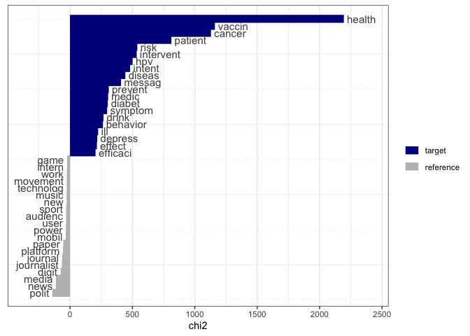

An analysis of the ICA 2020 program
================
Chung-hong Chan

``` r
require(tidyverse)
```

    ## Loading required package: tidyverse

    ## ── Attaching packages ────────────────────────────────── tidyverse 1.2.1 ──

    ## ✔ ggplot2 3.2.1     ✔ purrr   0.3.3
    ## ✔ tibble  2.1.3     ✔ dplyr   0.8.4
    ## ✔ tidyr   0.8.3     ✔ stringr 1.4.0
    ## ✔ readr   1.3.1     ✔ forcats 0.4.0

    ## ── Conflicts ───────────────────────────────────── tidyverse_conflicts() ──
    ## ✖ dplyr::filter() masks stats::filter()
    ## ✖ dplyr::lag()    masks stats::lag()

``` r
require(textclean)
```

    ## Loading required package: textclean

``` r
require(quanteda)
```

    ## Loading required package: quanteda

    ## Package version: 2.0.0

    ## Parallel computing: 2 of 4 threads used.

    ## See https://quanteda.io for tutorials and examples.

    ## 
    ## Attaching package: 'quanteda'

    ## The following object is masked from 'package:utils':
    ## 
    ##     View

``` r
ica_raw <- rio::import('70th Annual ICA Conference_29FEB2020.csv') %>% as_tibble
ica_raw
```

    ## # A tibble: 2,882 x 19
    ##    `Session or Eve… `Session or Eve… `Session or Eve… `Session or Eve…
    ##    <chr>            <chr>            <chr>            <chr>           
    ##  1 ICA Executive C… Business Meeting Sponsored Sessi… 19-May-2020     
    ##  2 Board of Direct… Breakfast        Sponsored Sessi… 20-May-2020     
    ##  3 Annual ICA Boar… Business Meeting Sponsored Sessi… 20-May-2020     
    ##  4 Board meeting l… Reception        Sponsored Sessi… 20-May-2020     
    ##  5 Volunteer Orien… Meeting          Sponsored Sessi… 20-May-2020     
    ##  6 Annual ICA Boar… Business Meeting Sponsored Sessi… 21-May-2020     
    ##  7 ICA Inclusion, … Meeting          Sponsored Sessi… 21-May-2020     
    ##  8 WELCOME TO COUN… Panel Session    Sponsored Sessi… 21-May-2020     
    ##  9 OPENING RECEPTI… Reception        Sponsored Sessi… 21-May-2020     
    ## 10 OPENING RECEPTI… Reception        Sponsored Sessi… 21-May-2020     
    ## # … with 2,872 more rows, and 15 more variables: `Session or Event Start
    ## #   Time` <chr>, `Session or Event End Time` <chr>, `Session or Event
    ## #   Location` <chr>, `Session or Event Details` <chr>, `Session or Event
    ## #   Participants/Hosts` <chr>, `Submission or Placeholder Title` <chr>,
    ## #   `Submission or Placeholder Start Time` <chr>, `Submission or
    ## #   Placeholder End Time` <chr>, `Submission Presenter Name` <chr>,
    ## #   `Submission Authors` <chr>, `Submission Status` <chr>, `Institutions
    ## #   All` <chr>, `Submission Body` <chr>, `Session Submission Sort
    ## #   Order` <int>, `The Program Report was last updated February 29, 2020
    ## #   at 12:13 AM EST. To view the most recent meeting schedule online,
    ## #   visit https://ica2020.abstractcentral.com/planner.jsp` <lgl>

``` r
colnames(ica_raw)
```

    ##  [1] "Session or Event Title"                                                                                                                                                       
    ##  [2] "Session or Event Type"                                                                                                                                                        
    ##  [3] "Session or Event Division/Interest Group"                                                                                                                                     
    ##  [4] "Session or Event Date"                                                                                                                                                        
    ##  [5] "Session or Event Start Time"                                                                                                                                                  
    ##  [6] "Session or Event End Time"                                                                                                                                                    
    ##  [7] "Session or Event Location"                                                                                                                                                    
    ##  [8] "Session or Event Details"                                                                                                                                                     
    ##  [9] "Session or Event Participants/Hosts"                                                                                                                                          
    ## [10] "Submission or Placeholder Title"                                                                                                                                              
    ## [11] "Submission or Placeholder Start Time"                                                                                                                                         
    ## [12] "Submission or Placeholder End Time"                                                                                                                                           
    ## [13] "Submission Presenter Name"                                                                                                                                                    
    ## [14] "Submission Authors"                                                                                                                                                           
    ## [15] "Submission Status"                                                                                                                                                            
    ## [16] "Institutions All"                                                                                                                                                             
    ## [17] "Submission Body"                                                                                                                                                              
    ## [18] "Session Submission Sort Order"                                                                                                                                                
    ## [19] "The Program Report was last updated February 29, 2020 at 12:13 AM EST. To view the most recent meeting schedule online, visit https://ica2020.abstractcentral.com/planner.jsp"

I am only interested in a few columns.

``` r
colnames(ica_raw)[2] <- "event_type"
colnames(ica_raw)[3] <- "event_group"
colnames(ica_raw)[5] <- "start_time"
colnames(ica_raw)[8] <- "event_info"
colnames(ica_raw)[17] <- "abstract"
ica_raw %>% count(event_type) -> all_event_types
### I am only interested in these sessions.
all_event_types[c(5, 6, 7, 8, 9, 11, 14),]
```

    ## # A tibble: 7 x 2
    ##   event_type                      n
    ##   <chr>                       <int>
    ## 1 Extended Session               20
    ## 2 High-Density Paper Session    194
    ## 3 Hybrid High-Density Session   197
    ## 4 Innovative Format              17
    ## 5 Interactive Paper Session     250
    ## 6 Panel Session                 914
    ## 7 Standard Paper Session       1121

``` r
##probably not the cleanest.

ica_raw %>% filter(event_type %in% all_event_types$event_type[c(5, 6, 7, 8, 9, 11, 14)]) %>% mutate(abstract = str_remove(replace_html(abstract), "^Abstracts? ?B?o?d?y?:? ?")) %>% filter(abstract != "") -> ica
ica %>% count(event_group, sort = TRUE) %>% add_count(wt = n, name = "total") %>% mutate(procent = round((n / total) * 100,2)) %>% select(-total) %>% knitr::kable()
```

| event\_group                                          |   n | procent |
| :---------------------------------------------------- | --: | ------: |
| Health Communication                                  | 267 |    9.93 |
| Communication and Technology                          | 232 |    8.63 |
| Journalism Studies                                    | 199 |    7.40 |
| Political Communication                               | 192 |    7.14 |
| Mass Communication                                    | 153 |    5.69 |
| Information Systems                                   | 141 |    5.25 |
| Public Relations                                      |  88 |    3.27 |
| Interpersonal Communication                           |  78 |    2.90 |
| Computational Methods                                 |  71 |    2.64 |
| Media Industry Studies                                |  71 |    2.64 |
| Environmental Communication                           |  69 |    2.57 |
| Organizational Communication                          |  69 |    2.57 |
| Sponsored Sessions                                    |  68 |    2.53 |
| Activism, Communication and Social Justice            |  62 |    2.31 |
| Mobile Communication                                  |  59 |    2.19 |
| Children, Adolescents and the Media                   |  58 |    2.16 |
| Global Communication and Social Change                |  58 |    2.16 |
| Instructional and Developmental Communication         |  58 |    2.16 |
| Popular Communication                                 |  58 |    2.16 |
| Ethnicity and Race in Communication                   |  57 |    2.12 |
| Game Studies                                          |  57 |    2.12 |
| Feminist Scholarship                                  |  55 |    2.05 |
| Human-Machine Communication                           |  54 |    2.01 |
| Visual Communication Studies                          |  52 |    1.93 |
| Sports Communication                                  |  45 |    1.67 |
| Philosophy, Theory and Critique                       |  44 |    1.64 |
| Lesbian, Gay, Bisexual, Transgender and Queer Studies |  36 |    1.34 |
| Intercultural Communication                           |  35 |    1.30 |
| Communication History                                 |  34 |    1.26 |
| Language and Social Interaction                       |  33 |    1.23 |
| Communication Science, and Biology                    |  30 |    1.12 |
| Communication Law and Policy                          |  28 |    1.04 |
| Theme                                                 |  28 |    1.04 |
| Intergroup Communication                              |  25 |    0.93 |
| Public Diplomacy                                      |  24 |    0.89 |

``` r
abstract_corpus <- corpus(ica$abstract)
docvars(abstract_corpus, "group") <- ica$event_group
```

``` r
dfm(abstract_corpus, tolower = TRUE, stem = TRUE, remove_punct = TRUE, remove_symbols = TRUE, remove = stopwords('en')) %>% dfm_select("^[A-Za-z]+$", valuetype = 'regex') -> abstract_dfm
```

Top Features of all ICA abstracts.

``` r
topfeatures(abstract_dfm, n = 50)
```

    ##        media        studi       social          use     communic 
    ##         4052         3732         3375         2938         2224 
    ##     research         news       inform       effect        polit 
    ##         2198         2093         1665         1571         1461 
    ##       public       examin       result        onlin       differ 
    ##         1459         1307         1288         1234         1227 
    ##     particip         find         data         also          can 
    ##         1200         1197         1196         1143         1096 
    ##        paper      analysi        relat        peopl      content 
    ##         1071         1059         1033         1028          995 
    ##       health       messag       cultur        digit     influenc 
    ##          980          978          954          954          938 
    ##       experi      practic      discuss     behavior      perceiv 
    ##          935          908          903          873          873 
    ##          one relationship          new        posit         user 
    ##          872          854          853          843          839 
    ##       theori         show        engag   understand     individu 
    ##          834          825          821          815          799 
    ##       provid      increas     interact        model          two 
    ##          784          784          783          783          780

# What the “big 10” scholars are writing?

## Health Communication

``` r
textstat_keyness(abstract_dfm, target = docvars(abstract_dfm, "group") == "Health Communication") %>% textplot_keyness
```

<!-- -->

## CAT

``` r
textstat_keyness(abstract_dfm, target = docvars(abstract_dfm, "group") == "Communication and Technology") %>% textplot_keyness
```

<!-- -->

## JSD

``` r
textstat_keyness(abstract_dfm, target = docvars(abstract_dfm, "group") == "Journalism Studies") %>% textplot_keyness
```

<!-- -->

|Health Communication | 267| 9.93| |Communication and Technology | 232|
8.63| |Journalism Studies | 199| 7.40| |Political Communication | 192|
7.14| |Mass Communication | 153| 5.69| |Information Systems | 141| 5.25|
|Public Relations | 88| 3.27| |Interpersonal Communication | 78| 2.90|
|Computational Methods | 71| 2.64| |Media Industry Studies | 71| 2.64|
